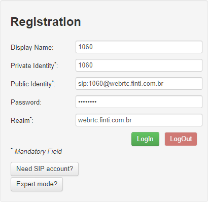
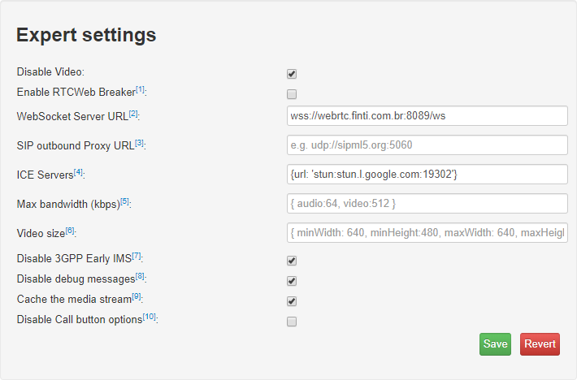

# Configurando SipML5

# Exemplo de configuração SIP

_sip.conf_

    ;
    ; SIP Configuration for Asterisk
    ;
    [general]
    context=default ; Default context for incoming calls. Defaults to 'default'
    allowoverlap=no                 ; Disable overlap dialing support. (Default is yes)
    realm=webrtc.finti.com.br       ; Realm for digest authentication
                                    ; defaults to "asterisk". If you set a system name in
                                    ; asterisk.conf, it defaults to that system name
                                    ; Realms MUST be globally unique according to RFC 3261
                                    ; Set this to your host name or domain name
    
    udpbindaddr=200.240.249.44      ; IP address to bind UDP listen socket to (0.0.0.0 binds to all)
                                    ; Optionally add a port number, 192.168.1.1:5062 (default is port 5060)
    videosupport=yes                ; Turn on support for SIP video. You need to turn this
                                    ; on in this section to get any video support at all.
                                    ; You can turn it off on a per peer basis if the general
                                    ; video support is enabled, but you can't enable it for
                                    ; one peer only without enabling in the general section.
                                    ; If you set videosupport to "always", then RTP ports will
                                    ; always be set up for video, even on clients that don't
                                    ; support it.  This assists callfile-derived calls and
                                    ; certain transferred calls to use always use video when
                                    ; available. [yes|NO|always]
    rtsavepath=yes                  ; If using dynamic realtime, store the path headers
    send_diversion=no               ; Default "yes"     ; Asterisk normally sends Diversion headers with certain SIP
                                                        ; invites to relay data about forwarded calls. If this option
                                                        ; is disabled, Asterisk won't send Diversion headers unless
                                                        ; they are added manually.
    rtpkeepalive=2                  ; Send keepalives in the RTP stream to keep NAT open (default is off - zero)(secs)
    ;--------------------------- SIP DEBUGGING ---------------------------------------------------
    ;sipdebug = yes                 ; Turn on SIP debugging by default, from
                                    ; the moment the channel loads this configuration
    icesupport = yes;
    ;----------------------------------------- REALTIME SUPPORT ------------------------
    ; For additional information on ARA, the Asterisk Realtime Architecture,
    ; please read https://wiki.asterisk.org/wiki/display/AST/Realtime+Database+Configuration
    ;
    rtcachefriends=yes              ; Cache realtime friends by adding them to the internal list
                                    ; just like friends added from the config file only on a
                                    ; as-needed basis? (yes|no)
    
    rtsavesysname=yes               ; Save systemname in realtime database at registration
                                    ; Default= no
    
    rtupdate=yes                    ; Send registry updates to database using realtime? (yes|no)
                                    ; If set to yes, when a SIP UA registers successfully, the ip address,
                                    ; the origination port, the registration period, and the username of
                                    ; the UA will be set to database via realtime.
                                    ; If not present, defaults to 'yes'. Note: realtime peers will
                                    ; probably not function across reloads in the way that you expect, if
                                    ; you turn this option off.
    rtautoclear=yes                 ; Auto-Expire friends created on the fly on the same schedule
                                    ; as if it had just registered? (yes|no|<seconds>)
                                    ; If set to yes, when the registration expires, the friend will
                                    ; vanish from the configuration until requested again. If set
                                    ; to an integer, friends expire within this number of seconds
                                    ; instead of the registration interval.

    [authentication]
    ;
    ; DTLS-SRTP CONFIGURATION
    ;
    dtlsenable = yes                   ; Enable or disable DTLS-SRTP support
    dtlsverify = no                    ; Verify that provided peer certificate and fingerprint are valid
    dtlscertfile=/etc/asterisk/keys/asterisk.pem                ; Path to certificate file to present
    dtlsprivatekey=/etc/asterisk/keys/asterisk.pem              ; Path to private key for certificate file
    dtlssetup = actpass                ; Whether we are willing to accept connections, connect to the other party, or both.
    
    [basic-options](!)                 ; a template
            dtmfmode=rfc2833
            context=from-office
            type=friend
    
    [natted-phone](!,basic-options)   ; another template inheriting basic-options
            directmedia=no
            host=dynamic
    
    [public-phone](!,basic-options)   ; another template inheriting basic-options
            directmedia=yes
    
    [my-codecs](!)                    ; a template for my preferred codecs
            disallow=all
            allow=ilbc
            allow=g729
            allow=gsm
            allow=g723
            allow=ulaw
    
    [ulaw-phone](!)                   ; and another one for ulaw-only
            disallow=all
            allow=ulaw
    
    [1060] ; This will be WebRTC client
    type=friend
    username=1060 ; The Auth user for SIP.js
    host=dynamic ; Allows any host to register
    secret=password ; The SIP Password for SIP.js
    encryption=yes ; Tell Asterisk to use encryption for this peer
    avpf=yes ; Tell Asterisk to use AVPF for this peer
    icesupport=yes ; Tell Asterisk to use ICE for this peer
    context=default ; Tell Asterisk which context to use when this peer is dialing
    directmedia=no ; Asterisk will relay media for this peer
    transport=udp,ws,wss ; Asterisk will allow this peer to register on UDP or WebSockets
    force_avp=yes ; Force Asterisk to use avp. Introduced in Asterisk 11.11
    dtlsenable=yes ; Tell Asterisk to enable DTLS for this peer
    dtlsverify=no ; Tell Asterisk to not verify your DTLS certs
    dtlscertfile=/etc/asterisk/keys/asterisk.pem ; Tell Asterisk where your DTLS cert file is
    dtlsprivatekey=/etc/asterisk/keys/asterisk.pem ; Tell Asterisk where your DTLS private key is
    dtlssetup=actpass ; Tell Asterisk to use actpass SDP parameter when setting up DTLS
    rtcp_mux=yes ; Tell Asterisk to do RTCP mux

# Exemplo de configuração PJSIP
_pjsip.conf_

    [transport_wss]
    type=transport
    bind=0.0.0.0
    protocol=wss
    
    [webrtc_client]
    type=aor
    max_contacts=5
    remove_existing=yes
      
    [webrtc_client]
    type=auth
    auth_type=userpass
    username=webrtc_client
    password=webrtc_client ; This is a completely insecure password!  Do NOT expose this
                           ; system to the Internet without utilizing a better password.
     
    [webrtc_client]
    type=endpoint
    aors=webrtc_client
    auth=webrtc_client
    dtls_auto_generate_cert=yes
    webrtc=yes
    ; Setting webrtc=yes is a shortcut for setting the following options:
    ; use_avpf=yes
    ; media_encryption=dtls
    ; dtls_verify=fingerprint
    ; dtls_setup=actpass
    ; ice_support=yes
    ; media_use_received_transport=yes
    ; rtcp_mux=yes
    context=default
    disallow=all
    allow=opus,ulaw

    [bob]
    type=aor
    max_contacts=10
    
    [bob]
    type=auth
    auth_type=userpass
    username=bob
    password=password ; This is a completely insecure password.  Do NOT expose this
                      ; system to the Internet without utilizing a better password.
    
    [bob]
    type=endpoint
    context=default
    direct_media=no
    ;allow=!all,ulaw,vp8,h264
    disallow=all
    allow=ulaw
    allow=opus
    aors=bob
    auth=bob
    ;max_audio_streams=10
    ;max_video_streams=10
    webrtc=yes
    dtls_cert_file=/etc/asterisk/keys/asterisk.pem
    dtls_ca_file=/etc/asterisk/keys/asterisk.crt
    
    [lucy]
    type=aor
    max_contacts=1
    
    [lucy]
    type=auth
    auth_type=userpass
    username=lucy
    password=password ; This is a completely insecure password.  Do NOT expose this
                      ; system to the Internet without utilizing a better password.
    
    [lucy]
    type=endpoint
    context=default
    direct_media=no
    ;allow=!all,ulaw,vp8,h264
    disallow=all
    allow=ulaw
    allow=opus
    aors=lucy
    auth=lucy
    ;max_audio_streams=10
    ;max_video_streams=10
    webrtc=yes
    dtls_cert_file=/etc/asterisk/keys/asterisk.pem
    dtls_ca_file=/etc/asterisk/keys/asterisk.crt

## Registration:

    Display Name:       1060
    Private Identity:   1060
    Public Identity:    sip:1060@webrtc.finti.com.br
    Password:           password
    Realm:              webrtc.finti.com.br
    

## Expert settings

    Disable Video:                  yes
    Enable RTCWeb Breaker:
    WebSocket Server URL:           wss://webrtc.finti.com.br:8089/ws
    SIP outbound Proxy URL:
    ICE Servers:                    {url: 'stun:stun.l.google.com:19302'}
    Max bandwidth (kbps):
    Video size:
    Disable 3GPP Early IMS:         yes
    Disable debug messages:         yes
    Cache the media stream:         yes
    Disable Call button options:
    
