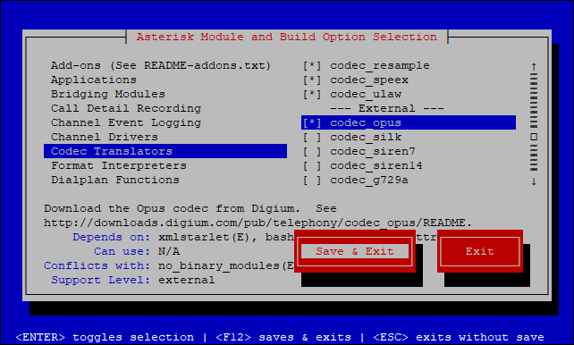

# Configurando WebRTC para Asterisk

WebRTC e SIP são as duas tecnologias mais importantes para comunicação em tempo real atualmente. Session Initiation Protocol (SIP) é largamente usado na tecnologia VoIP; WebRTC é usado em navegadores, dispositivos moveis sem necessidade de programas adicionais.

Com o constante desenvolvimento e atualização do WebRTC os navegagores passaram a exigir o uso de certificados válidos para o funcionamento do WebRTC em seus navegadores, mesmo para testes em uma rede local um certificado auto-assinado não irá funcionar.

## Instalando Certificado

1. Remova qualquer pré instalação do certbob

    ```bash
    sudo apt-get remove certbot
    ```

1. Instale o ``certbot-auto`` no seu sistema

    ```bash
    wget https://dl.eff.org/certbot-auto
    sudo mv certbot-auto /usr/local/bin/certbot-auto
    sudo chown root /usr/local/bin/certbot-auto
    sudo chmod 0755 /usr/local/bin/certbot-auto
    ```

1. Criando o certificado
    
    ```bash
    /usr/local/bin/certbot-auto certonly --standalone -d example.com -d www.example.com
    ```
    
    Caso o ``certbot`` não tenha acesso direto ao servidor para validar o seu dominio, será necessário executar o comando abaixo e adicionar o TXT informado ao DNS.
    
    ```bash
    /usr/local/bin/certbot-auto certonly \
     --server https://acme-v02.api.letsencrypt.org/directory \
     --manual --preferred-challenges dns \
     -d *.domain.com -d domain.com
    ```
    
    Os certificados e chave serão salvos em ``/etc/letsencrypt/live/`` com o nome do dominio escolhido.

1. Crie a pasta que irá armazenar os certificados do asterisk

    ```bash
    mkdir /etc/asterisk/keys
    ```

1. Copie os certificados para o Asterisk

    ```bash
    cp /etc/letsencrypt/live/example.com/cert.pem /etc/asterisk/keys/asterisk.pem
    cat /etc/letsencrypt/live/example.com/privkey.pem >> /etc/asterisk/keys/asterisk.pem
 
    cp /etc/letsencrypt/live/example.com/fullchain.pem /etc/asterisk/keys/asterisk.crt
    cp /etc/letsencrypt/live/example.com/privkey.pem >> /etc/asterisk/keys/asterisk.key
    ```

## Instalando Asterisk

> _**NOTA:**_ Este passo só é necessário para Asterisk 13 e 14, Para versões iguais ou superior ao Asterisk 15 pode-se ignorar este passo.

O Asterisk deve ser instalado com suporte ao ``pjsip``. Primeiramente rode ``./contrib/scripts/install_prereq``. Montar o pacote do projeto pjproject necessita a biblioteca de desenvolvimento do python com que será instalado através do ``install_prereq``.

Tudo o que você deve fazer é adicionar a opção ``--with-pjproject-bundled`` na linha de comando do Asterisk ``./configure`` e remover qualquer outra opção ``--with-pjproject`` que você possa ter específicado.

```bash
cd /path/asterisk-source-dir
$ ./configure --with-pjproject-bundled
```

Com o comando ``make menuselect`` certifique se de que o codec ``opus`` será instalado selecionando o no menu ``Codec Translators`` e marcando ``codec_opus``, salve e continue a instalação com ``make install``.



## Configurando o Asterisk

Para se comunicar com os clientes websocket o Asterisk usa seu construtor daemon HTTP embutido. Configure ``/etc/asterisk/http.conf`` conforme segue:

```bash
[general]
enabled=yes
bindaddr=0.0.0.0
bindport=8088
tlsenable=yes
tlsbindaddr=0.0.0.0:8089
tlscertfile=/etc/asterisk/keys/asterisk.crt
tlsprivatekey=/etc/asterisk/keys/asterisk.key
```

### Configurando o sip.conf
Edite o arquivo ``sip.conf`` aqui será configurado dois ramais, um para cliente WebRTC e um cliente não WebRTC. O ramal WebRTC necessita criptografia, ``avpf`` e ``icesupport`` precisam ser habilitados. Na maioria dos casos, ``directmedia`` deve estar desabilitado. No cliente WebRTC o campo ``transport`` deve ser listado como ``ws`` para permitir conexões websocket. Todas essas linhas de configuração devem estar dentro do proprio ramal; definir essas linhas de configuração globalmente podem não funcionar.

```bash
[general]
realm=127.0.0.1 ; Replace this with your IP address
udpbindaddr=127.0.0.1 ; Replace this with your IP address
transport=udp

[1060] ; This will be WebRTC client
type=friend
username=1060 ; The Auth user for SIP.js
host=dynamic ; Allows any host to register
secret=password ; The SIP Password for SIP.js
encryption=yes ; Tell Asterisk to use encryption for this peer
avpf=yes ; Tell Asterisk to use AVPF for this peer
icesupport=yes ; Tell Asterisk to use ICE for this peer
context=default ; Tell Asterisk which context to use when this peer is dialing
directmedia=no ; Asterisk will relay media for this peer
transport=udp,ws,wss ; Asterisk will allow this peer to register on UDP or WebSockets
force_avp=yes ; Force Asterisk to use avp. Introduced in Asterisk 11.11
dtlsenable=yes ; Tell Asterisk to enable DTLS for this peer
dtlsverify=fingerprint ; Tell Asterisk to verify DTLS fingerprint
dtlscertfile=/etc/asterisk/keys/asterisk.pem ; Tell Asterisk where your DTLS cert file is
dtlssetup=actpass ; Tell Asterisk to use actpass SDP parameter when setting up DTLS
rtcp_mux=yes ; Tell Asterisk to do RTCP mux

[1061] ; This will be the legacy SIP client
type=friend
username=1061
host=dynamic
secret=password
context=default
```

### Configurando o pjsip.conf

Para registrar os clientes usando ``pjsip`` é necessário parar o carregamento do modulo ``sip``, já que não se pode usar os dois ao mesmo tempo, adicione a seguinte linha ao final do arquivo ``modules.conf``:

```bash
noload => chan_sip.so'
```

O cliente ``199`` é para telefones web, ``3001`` e ``3002`` são para clientes SIP:

```bash
[transport-wss]
type=transport
protocol=wss
bind=0.0.0.0

[199]
type=endpoint
aors=199
auth=199
use_avpf=yes
media_encryption=dtls
dtls_ca_file=/etc/asterisk/keys/ca.crt
dtls_cert_file=/etc/asterisk/keys/asterisk.pem
dtls_verify=fingerprint
dtls_setup=actpass
ice_support=yes
media_use_received_transport=yes
rtcp_mux=yes
context=helloworld2
disallow=all
allow=ulaw
allow=opus

[199]
type=auth
auth_type=userpass
username=199
password=199@pass1 

[199]
type=aor
max_contacts=1
remove_existing=yes


[transport-udp]
type=transport
protocol=udp
bind=0.0.0.0

[3001]
type=endpoint
context=helloworld2
disallow=all
allow=ulaw
auth=3001
aors=3001

[3001]
type=auth
auth_type=userpass
password=3001pass
username=3001

[3001]
type=aor
max_contacts=1
remove_existing=yes

[3002]
type=endpoint
context=helloworld2
disallow=all
allow=ulaw
auth=3002
aors=3002

[3002]
type=auth
auth_type=userpass
password=3002pass
username=3002

[3002]
type=aor
max_contacts=1
remove_existing=yes
```

### Configurando rtp.conf

Precisa ter estes no ``rtp.conf``.

```bash
[general]
rtpstart=10000
rtpend=20000
icesupport=true
stunaddr=stun.l.google.com:19302
```

## Verifique as Configurações

1. Reinicie o asterisk

    ```bash
    asterisk -rx "core restart now"
    ```

1. Verifique se o servidor web esta rodando:

    ```bash
       netstat -an | grep 8089
    ```
    
    Você deve ver:
    
    ```bash
    tcp        0      0 0.0.0.0:8089            0.0.0.0:*               OUÇA
    ```

1. Para assegurar que os módulos foram carregados pelo Asterisk, execute os seguintes comandos:

    ```bash
    asterisk -rx "module show like crypto"
    asterisk -rx "module show like websocket"
    asterisk -rx "module show like opus"
    ```
    
    Você deve ver uma saída semelhante a esta:
    
    ```bash
    asterisk -rx "module show like crypto"
    Module                         Description                              Use Count  Status      Support Level
    res_crypto.so                  Cryptographic Digital Signatures         1          Running              core
    1 modules loaded
 
    asterisk -rx "module show like websocket"
    Module                         Description                              Use Count  Status      Support Level
    res_http_websocket.so          HTTP WebSocket Support                   3          Running          extended
    res_pjsip_transport_websocket.so PJSIP WebSocket Transport Support        1          Not Running          core
    2 modules loaded
 
    asterisk -rx "module show like opus"
    Module                         Description                              Use Count  Status      Support Level
    codec_opus.so                  OPUS Coder/Decoder                       0          Running          extended
    format_ogg_opus.so             OGG/Opus audio                           0          Running              core
    res_format_attr_opus.so        Opus Format Attribute Module             1          Running              core
    3 modules loaded
    ```


 

Fontes: [certbot](https://certbot.eff.org/lets-encrypt/debianjessie-other), [sipjs](https://sipjs.com/guides/server-configuration/asterisk/), [wiki asterisk](https://wiki.asterisk.org/wiki/display/AST/Configuring+Asterisk+for+WebRTC+Clients), [asterisk_webrtc](https://gist.github.com/bigyan/ce2763cf53a3d3e7d2803e03835b18ad)