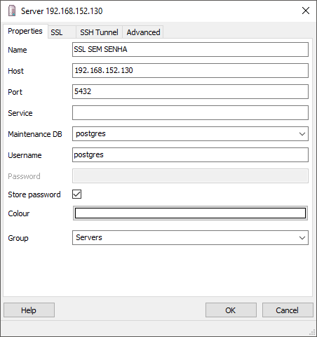
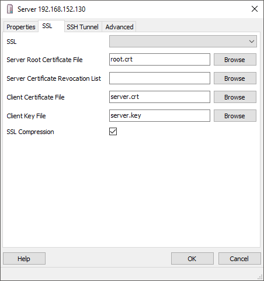

# Configurando SSL para PostgreSQL

PostgreSQL possui suporte nativo para o uso de conexões SSL criptografando a comunicação entre cliente/servidor para aumentar o nível de segurança. Isto exige a instalação do OpenSSL em nos sistemas do cliente e do servidor e que o suporte esteja habilitado no momento da instalação.

Com o suporte ao SSL compilado, o PostgreSQL pode ser iniciado com o SSL habilitado quando configurado o parametro ``ssl`` pra ``on`` no ``postgresql.conf``. O servidor irá esperar por ambas as conexões normal e conexões SSL na mesma porta TCP, e irá negociar com qualquer cliente quando usado SSL. Por padrão, isto é uma opção do cliente, porem é possivel configurar o servidor para que ele exija o uso de SSL para todas as conexões.

## Criando os Certificados
Crie a pasta ``keys`` que irá abrigar as chaves do servidor PostgreSQL e então entre ela.

```bash
mkdir /etc/postgresql/9.6/main/keys
cd /etc/postgresql/9.6/main/keys
```

Para criar um certificado auto-assinado simple para o servidor, valido por 10 anos (3650 dias), use o seguinte comando OpenSSL, substitua ``dbhost.yourdomain.com`` pelo nome do servidor.

```bash
openssl req -new -x509 -days 3650 -nodes -text -out server.crt \
  -keyout server.key -subj "/CN=dbhost.yourdomain.com"
```

Altere as permissões do certificado ou o servidor irá regeita-lo se ele estiver mais liberal que isto:

```bash
chmod og-rwx server.key
```

Enquanto um certificado auto assinado pode ser usado para teste, um certificado assinado por uma autoridade certificadora (CA) (usualmente uma empresa CA) deve ser usado em produção.

Para criar um certificado do qual a identidade pode ser validada pelos clientes, primeiro crie um certificado de pedido de assinatura (CSR) e um arquivo de chave pública/privada.

```bash
openssl req -new -nodes -text -out root.csr \
  -keyout root.key -subj "/CN=root.yourdomain.com"
chmod og-rwx root.key
```

Em seguida, assine a solicitação com a chave para criar uma autoridade de certificação raiz (usando o local padrão do arquivo de configuração OpenSSL no Linux):

```bash
openssl x509 -req -in root.csr -text -days 3650 \
  -extfile /etc/ssl/openssl.cnf -extensions v3_ca \
  -signkey root.key -out root.crt
```

Por fim, crie um certificado de servidor assinado pela nova autoridade de certificação raiz:

```bash
openssl req -new -nodes -text -out server.csr \
  -keyout server.key -subj "/CN=dbhost.yourdomain.com"
chmod og-rwx server.key

openssl x509 -req -in server.csr -text -days 3650 \
  -CA root.crt -CAkey root.key -CAcreateserial \
  -out server.crt
```

``server.crt`` e ``server.key`` devem ser armazenados no servidor e ``root.crt`` deve ser armazenado no cliente para que o cliente possa verificar se o certificado de folha do servidor foi assinado por seu certificado raiz confiável. ``root.key`` deve ser armazenado offline para uso na criação de futuros certificados.

## Configurando o SSL
Para finalizar as configurações é preciso aplicar mais algumas modificações ao arquivo ``postgresql.conf``.

Navegue até encontrar a sessão _**Security and Authentication**_ e ative o uso do **SSL** descomentando a linha ``ssl``e alterando o seu valor de ``true`` para ``on``.
```bash
vi /etc/postgresql/9.6/main/postgresql.conf
```

```bash
ssl = on
```

Também é necessário alterar as configurações SSL do servidor, encontre as linhas abaixo:

```bash
ssl_cert_file = '/etc/ssl/certs/ssl-cert-snakeoil.pem'          # (change requires restart)
ssl_key_file = '/etc/ssl/private/ssl-cert-snakeoil.key'         # (change requires restart)
#ssl_ca_file = ''                       # (change requires restart)
```

Altere as configurações de acordo com os certificados criados, sendo também necessário descomentar a linha ``ssl_ca_file``.

```bash
ssl_cert_file = '/etc/postgresql/9.6/main/keys/server.crt'
ssl_key_file = '/etc/postgresql/9.6/main/keys/server.key'
ssl_ca_file = '/etc/postgresql/9.6/main/keys/root.crt'
```

É necessário dar a propriedade da chave ``server.key`` para o usuário ``postgres`` para que o servidor consiga ler ela. 

```bash
chown postgres.postgres server.key
```

Reinicie o PostgreSQL para que as mudanças tenham efeito:

```bash
service postgresql restart
```

Você pode verificar se o PostgreSQL esta rodando através do comando:

```bash
netstat -an | grep 5432
```

Você terá uma saída semelhante a abaixo:

```bash
tcp        0      0 0.0.0.0:5432            0.0.0.0:*               OUÇA
tcp6       0      0 :::5432                 :::*                    OUÇA
unix  2      [ ACC ]     STREAM     OUVINDO       15566    /var/run/postgresql/.s.PGSQL.5432
``` 

Caso deseje obrigar que determinado usuario se autentique obrigatoriamente usando SSL edite o arquivo ``pg_hba.conf``:

```bash
vi /etc/postgresql/9.6/main/pg_hba.conf
```

Comente a linha abaixo pois ela permite que os usuarios se autentiquem por senha:

```bash
#host    all             all             0.0.0.0/0               md5
```

Adicione a linha abaixo e subistitua o usuário ``postgres`` pelo usuario do banco que deverá autenticar exclusivamente usando SSL.
```bash
hostssl all             postgres        0.0.0.0/0               md5 clientcert=1
```

adicionando a seguinte linha, alterando o usuario ``postgres`` pelo usuário desejado.

## Configurando o cliente

Crie uma pasta chamada ``client`` e copie os certificados que serão usados pelo cliente para ela:

```bash
mkdir /etc/postgresql/9.6/main/keys/client
cp /etc/postgresql/9.6/main/keys/{server.crt,server.key,root.crt} /etc/postgresql/9.6/main/keys/client
```

#### Configurando o pgAdmin III

Com as chaves em mãos é possível fazer o login ao utilizando SSL.

Preencha os campos conforme as imagems abaixo:



Preencha o SSL do cliente da seguinte forma:

* Server Root Certificate File: ``root.crt``
* Client Certificate File: ``server.crt``
* Client Key File: ``server.key``




Fonte: [PostgreSQL](https://www.postgresql.org/docs/9.6/ssl-tcp.html)

Verificar: [HowToForge](https://www.howtoforge.com/postgresql-ssl-certificates), [iMasters](https://imasters.com.br/data/estabelecendo-conexao-ssl-segura-com-o-servidor-banco-de-dados-postgresql) 