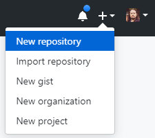

# Adicionando um projeto ao GitHub

## 1. Criando um repositório

Crie um novo repositório no GitHub. Para evitar erros, não inicie um novo projeto com arquivos README, licença ou gitignore. Você pode adicionar estes mais tarde, quando seu projeto já tiver sido enviado.

## 2. Começando o projeto 

Entre na pasta onde encontra-se o seu projeto.

    cd bank

## 3. Inicializando o repositório

Inicialize a sua pasta atual como um repositório Git.

    git init
    
## 4. Adicionando arquivos

Adicione os arquivos no seu novo repositório local. Isto os organiza para o primeiro envio.

    git add .

## 5. Declarando as alterações do envio 

Envie os arquivos que você organizou em seu repositório local.
    
    git commit -m "Primeiro envio"
    
## 6. Adicionado destino do envio

No prompt de comando adicione o endereço para o repositório remoto onde o seu repositório local será enviado.

    git remote add origin remote repository URL
    # Sets the new remote
    
    git remote -v
    # Verifies the new remote URL

    git remote add origin https://github.com/celsoannes/bankbkp.git

## 7. Enviando as alterações 

Envie as alterações do seu repositório local para o GitHub.

    git push origin master

Fonte: [Github](https://help.github.com/articles/adding-an-existing-project-to-github-using-the-command-line/)