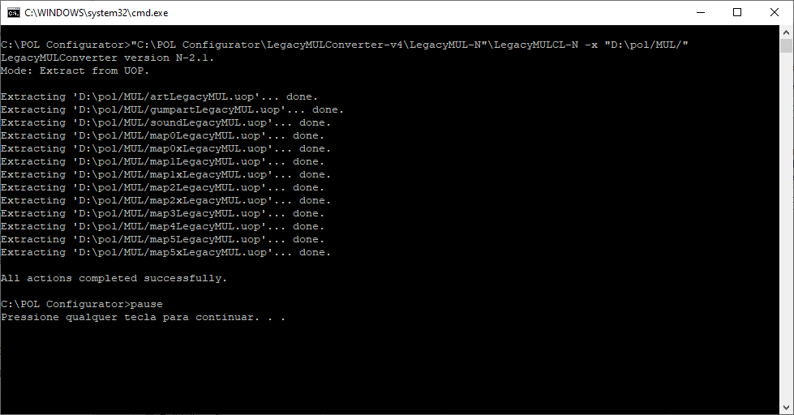
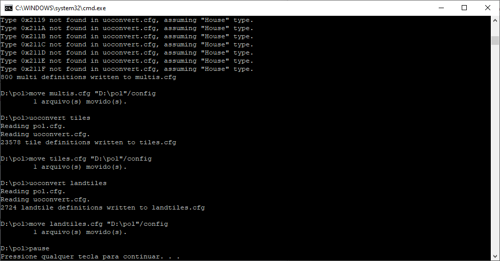

# Configurando um Servidor POL no Windows

### Pré-requisitos do tutorial

* POL Core 99.1
  * [Windows (.zip)](https://downloads.polserver.com/browser.php?download=./Core/Windows/099/pol-core-099.1-Official%20Release-x64-2018-02-12.zip) | [Source](https://github.com/polserver/polserver/tree/POL099)
* POL Distro in the classic 095-style (POL 099)
  * [Windows (.zip)](https://api.github.com/repos/PolServer/ClassicDistro/zipball/) | [Source](https://github.com/polserver/ClassicDistro)
* [Pol Configurator](https://downloads.polserver.com/browser.php?download=./Tools/Install_The_POL_Configurator.exe)
* [Ultima Online Classic Client versão 7+](https://uo.com/client-download/)

O servidor **POL** é composto de duas partes, o `Core` e a `Distro`. **POL** é uma máquina virtual (VM). `Core` é a parte princial do **POL**. `Distro` é a coleção de programas `eScript` que emula um servidor **UO**. Existe um cruzamento entre `Core` e `Distro` no que diz respeito a emulação de um servidor **Ultima Online**, mas a maioria de tudo que controla a jogabilidade é feita pelos programas `eScript`. Apenas para esclarecer, `eScript` é a linguagem usada para escrever programas, chamados `scripts` pela maioria das pessoas, que o **POL Core** roda para emular o mundo de **Ultima Online** que conhecemos e amamos.

Eu sugiro que você leia todo o tutorial primeiro então você terá o conhecimento dos passos envolvidos. Então volte e siga passo a passo para rodar e levantar.

## 1. Obtendo os pacotes POL

### 1.1 POL Core 

A primeira coisa que você vai precisar será os arquivos do `Core`. Você pode encontrar a última versão estável [aqui](https://forums.polserver.com/app.php/page/downloads). Baixe o arquivo. Cria uma pasta e extraia os arquivos do arquivo ZIP para a pasta criada.

### 1.2 POL Distro

#### 1.2.1 Classic Distro
Agora você precisa da `Distro`. Existem duas versões disponível. Se você que a experiência clássica do Ultima online sem nenhum tipo de madeira especial ou customizada e sem modificação no dano baseado nos materiais usados para criar uma arma então a `Classic Distro` é para você. A `Classic Distro` foi projetada para desenvolvedores que desejam um emulador de Ultima Online básico funcional que eles possam modificar para funcionar da maneira que desejam, sem necessidade de remover muitas funcionalidades extras indesejadas. Ele também esta disponível na página de [Downloads](https://forums.polserver.com/app.php/page/downloads).

#### 1.2.2 Modern Distro
A outra opção é a `Modern Distro`. Ele tem um sistema de construção modelado de acordo com o sistema OSI como se parece hoje, mais as adições das resistencias e tipos de dano que você encontra na versão atual do Ultima Online. A Distro moderna ainda é um trabalho em andamento. Então, algumas coisas podem não funcionar corretamente, embora a maioria deva. Aposto que agora você já consegue adivinhar aonde você é capaz de encontra a [Modern Distro](https://forums.polserver.com/app.php/page/downloads).

>Eu recomendo iniciar com a `Classic Distro` para seguir este tutorial. 

## 2. Preparando Ambiente

Uma vez que você tenha baixado a `Distro`, extraia os arquivos do arquivo ZIP para o diretório em que você colocou os arquivos do `Core`. Observe que os Arquivos da `Distro` estão dentro de uma pasta dentro do arquivo ZIP. Você precisará abrir essa pasta para extrair os arquivos da `Distro`. Você não deve receber nenhum alerta sobre sobrescrever os arquivos, mas se você receber, deixe que o Windows substitua os arquivos pelos do arquivo ZIP da `Distro`.

## 3. Configurator Servidor POL

O `POL Core` depende das configurações contidas em pelo menos sete arquivos de configuração. Estes arquivos estão em texto puro. Se você quiser você pode editá-los a mão. Eu não recomendo isso, a menos que você goste de fazer as coisas da maneira mais difícil. 

### 3.1 Baixando POL Configurator

Felizmente existe uma ferramenta disponíve, o [POL Configurator](https://downloads.polserver.com/browser.php?download=./Tools/Install_The_POL_Configurator.exe) que apresenta estas configurações em uma interface gráfica que torna a configuração do **POL** muito mais fácil. Você pode ler sobre isso nos [Fóruns do POL](https://forums.polserver.com/viewtopic.php?f=1&t=6063).

### 3.2 Localizando o diretório POL

Depois de baixar o ``POL Configurator``, clique duas vezes no arquivo `pol_configurator.exe` para iniciar o programa. Próximo ao canto inferior esquerdo da janela do programa, use o botão `Browse` proximo à caixa de texto onde diz `Location of your POL Directory` para localizar sua nova pasta **POL**.

Lembre-se de que a caixa de diálogo que se abre é uma caixa de seleção de **diretório**. Destaque o diretório e clique no botão Selecionar pasta. Será apresentado uma caixa de diálogo informando que esta faltando o arquivo `ecompile.cfg` em sua instalação do **POL**.

Isto é normal porque não fornecemos um arquivo `ecompile.cfg` padrão com os arquivos `Core` ou `Distro`. Isto é porque alguma das configurações neste arquivo dependem do local onde você instalou o **POL**. Clique no botão `Yes` para permitir que o `POL Configurator` forneça o arquivo ausente. Uma mensagem aparecerá informando que o arquivo ausente foi adicionado à sua instalação. Clique no botão OK.

### 3.3 Localizando o diretório do cliente de Ultima Online

Agora você precisa informar ao `POL Configurator` onde seus arquivos do cliente do Ultima Online se encontram. Use o botão `Browser` proximo à caixa de texto com o nome `Location of your UO installation` para localizar a pasta do seu cliente de Ultima Online, no meu caso é `C:\Program Files (x86)\Electronic Arts\Ultima Online Classic`.

Se você não selecionar os diretórios adequados para **POL** ou **Ultima Online**, o `POL Configurator` irá informá-lo. O Configurador procura determinados arquivos nesses diretórios para determinar se você selecionou locais válidos. Se você receber uma notificação de que um desses diretórios não é um local válido, tente localizar a pasta apropriada novamente. Lembre-se de que essas são **caixas de seleção de diretório**. Eles diferem das caixas de seleção de arquivos. Você só precisa realçar, clicar uma vez no diretório e clicar no botão Selecionar pasta.

### 3.4 Configurando diretório eCompile

Assumindo que não houve problemas para localizar suas instalações **POL** e **Ultima Online**, a próxima coisa é revisar as configurações atuais. Clique na guia `eCompile` e verifique se as configurações de diretório estão corretas na caixa de grupo `eCompile CFG Directory Setting`. Elas devem estar, mas se não estiverem, navegue até as pastas apropriadas. Se você precisar fazer isso, use os exemplos a seguir, assumindo que sua instalação do **POL** é `D:\pol`.

O diretório `/devpkg` é opcional. Você não terá um diretório com esse nome na Distro e nenhum erro ocorrerá se ele não existir. Ele é destinado para pacotes que estão em desenvolvimento, mas não prontos para serem implementados.

### 3.5 Configurações do Servidor

No momento em que estou escrevendo, `15/05/2021`, se você estiver usando uma versão cliente na faixa 7+, as outras configurações padrão funcionarão bem. e a sua versão for inferior a 7, pode ser necessário ajustar certas configurações para atender aos requisitos do seu cliente. Veja o grupo `Expansion Settings` na aba `Server Settings` se você precisar configurar o servidor para uma expansão anterior.

Sinta-se à vontade para dar uma olhada em todas as várias configurações disponíveis com o POL. O `POL Configurator` possui dicas para a maioria das configurações que explicam, resumidamente, sua função. Basta passar o ponteiro do mouse sobre a caixa de seleção, caixa de entrada de texto ou caixa suspensa para ver a dica de ferramenta. Depois de revisar suas configurações e estiver satisfeito com elas, clique no botão `Save Settings`.

Será exibida uma caixa de diálogo informando que estão faltando os arquivos `accounts.txt` e `pol.txt`. Isso é normal ao configurar uma das versões da `Distro`. Não incluímos nenhum desses arquivos nos downloads da `Distro` ou `Core`. Marque a caixa de seleção ` Clear Game Data?`.

Não se preocupe. Como esta é uma instalação nova, você não possui dados de jogo. As caixas de entrada de texto para nome de usuário e senha serão habilitadas. O nome de usuário e a senha são usados para criar a conta do desenvolvedor do shard. Observe que a senha não está mascarada na caixa de texto com asteriscos. Depois de inserir um nome de usuário e senha, clique no botão `Yes`.

Será apresentada uma mensagem informando sobre a criação de `accounts.txt` e `pol.txt`. Clique no botão `OK`.

### 3.6 Configurando os Mapas e Reinos

É hora de criar a representação interna do **POL** dos mapas mundiais e alguns arquivos de configuração relacionados a `art tiles`, `landtiles`, and `multis`. Vá para a aba `Facet Generation`. Note que o único grupo habilitado é `Copy UO Files`.

#### 3.6.1 Copiando UOP, statics, e arquivos tiledata

Novamente, vamos assumir que você está usando um cliente versão 7 ou posterior. Se você estiver usando uma versão anterior do cliente, desmarque a caixa de seleção `Copy only UOP, statics, and tiledata Files` Agora clique no botão `Copy Required Files`.

Assim que o processo de cópia do arquivo for concluído, os outros grupos serão habilitados.

#### 3.6.2 Descompactando arquivos MUL a partir de arquivos UOP

Se você estiver usando a versão estável do POL 099.1, que deveria ser para este tutorial e estiver usando um cliente da versão 7 ou superior, você deve extrair os arquivos `*.mul` dos arquivos `*.uop` mais recentes que as versões de clientes 7 ou superiores usam.

No canto superior direito da página `Facets Generation`, você verá o grupo `UOP/MUL Unpack and Repack`. Clique no botão `Unpack the MUL files from the UOP files`.

Isso abrirá uma janela de linha de comando e executará um programa externo para realizar a extração. Assim que terminar, pressione qualquer tecla para fechar a janela. 

> Devo mencionar que o POL 100, que está atualmente em beta, não exige que você extraia os arquivos `*.mul`, mas existem outros motivos, como a edição de mapas, onde os arquivos MUL precisam ser extraídos. Não editaremos mapas neste tutorial.

#### 3.6.3 Compilando Tiles, Multis e Landtiles

Agora, de volta ao lado esquerdo da página ... Logo abaixo do grupo `Copy UO Files` está o grupo `Tiles, Multis e Landtiles`. As três caixas de seleção nesse grupo devem ser marcadas. Se não estiverem todas marcadas, marque-as. Em seguida, clique no botão `Build the selected cfg files`.

Isso abrirá outra janela de comando e executará o programa `uoconvert.exe` que gerará os três arquivos `cfg`. Novamente, uma vez feito isso, pressione uma tecla para fechar a janela.

#### 3.6.4 Gerando os arquivos de mapa para o POL

Agora é hora de gerar as `facets`. **POL** usa o termo `realm` ao invés de `facet`. Não sei por que foi escolhido, mas foi. Portanto, em programas `eScript`, usamos o termo `realm`, mas aqui chamaremos os diferentes mapas por sua designação oficial de `facets`.

No grupo `Map Generation Settings` selecione o tamanho do mapa. Para clientes anteriores ao `Mondain’s Legacy`, escolha o tamanho do mapa do `Third Dawn Map Size`. Caso contrário, você pode deixá-lo definido para o tamanho `Mondain’s Legacy Map Size`.

Abaixo do seletor de tamanho do mapa, você pode escolher as `facets` que deseja gerar. Eu recomendo selecionar todos eles, mas pelo menos selecione `Felucca`. Você também pode optar por usar os arquivos `*.Dif` adicionais ao gerar as `facets`. Não tenho certeza do que são os arquivos `Dif`, mas pelo que entendi, eles são usados para corrigir os arquivos de mapa principais. Se alguém souber mais sobre seu propósito, agradeço sua opinião. Uma vez que você tenha feito a seleção das `facets` clique no botão `Build the Selected Facets`

Isso abrirá uma janela de comando e executará `uoconvert.exe` para gerar os arquivos de mapa internos para o **POL**.

Estamos quase terminando. Eu sei que ler isso faz com que pareça um longo processo, mas é muito rápido quando você realmente está fazendo isso.

### 3.7 O último passo

Clique na aba `eCompile`. Mais ou menos no meio da página, você verá três botões largos. Gosto de ver os programas, geralmente chamados de scripts, sendo compilados. Então clique no botão `Compile modified Scripts. Send output to the console`.

Uma janela de comando será aberta e você verá a saída do eCompile conforme ele compila cada programa eScript. Assim que a compilação terminar, pressione qualquer tecla.

### 3.8 Testar e Rodar

Eu disse que era o último passo. Eu menti. Você tem mais uma coisa a fazer. Na extremidade direita da janela do `POL Configurator`, você verá dois botões grandes perto da parte inferior, `Test Launch POL` e `Run POL`. A última etapa é escolher um desses botões. Sugiro usar o `Test Launch POL`, pois é a primeira vez que você está executando o **POL**.

As dicas de ferramentas para cada botão explicarão a diferença entre eles. Uma nova janela de comando será aberta e você deverá ver o **POL** carregando os `realms` (`facets`), pacotes e várias outras coisas que ele precisa fazer para iniciar.

Quando você quiser desligar o servidor, existem várias maneiras de fazer isso. Uma maneira é pressionar `<ctrl> + c` quando a janela de comando do servidor estiver em foco. Você pode inserir um ponto de interrogação (`?`) Quando a janela do servidor estiver em foco para ver uma lista de comandos do console disponíveis para você. Antes que o **POL** aceite qualquer um desses comandos, você deve primeiro desbloquear o console para entrada pressionando ``<shift> + s``. Você pode travar novamente o console pressionando `<shift> + s` novamente.

Agora tudo o que você precisa fazer é configurar seu cliente para efetuar login. Há um IP de host local padrão já definido nos arquivos de configuração. Configure seu cliente para usar IP `127.0.0.1`, porta `5003` e sem criptografia. Agora faça o login e divirta-se.

> Sugeri usar a `Classic Distro` com este tutorial porque tenho certeza de que não há problemas com seus programas (`scripts`). No entanto, esse mesmo processo pode ser usado com a `Modern Distro` e deve funcionar com qualquer shard de mundo completo que seja compatível com **POL 099.1**.

Fonte: [Forum Penultima Online](https://forums.polserver.com/viewtopic.php?f=51&t=6225).