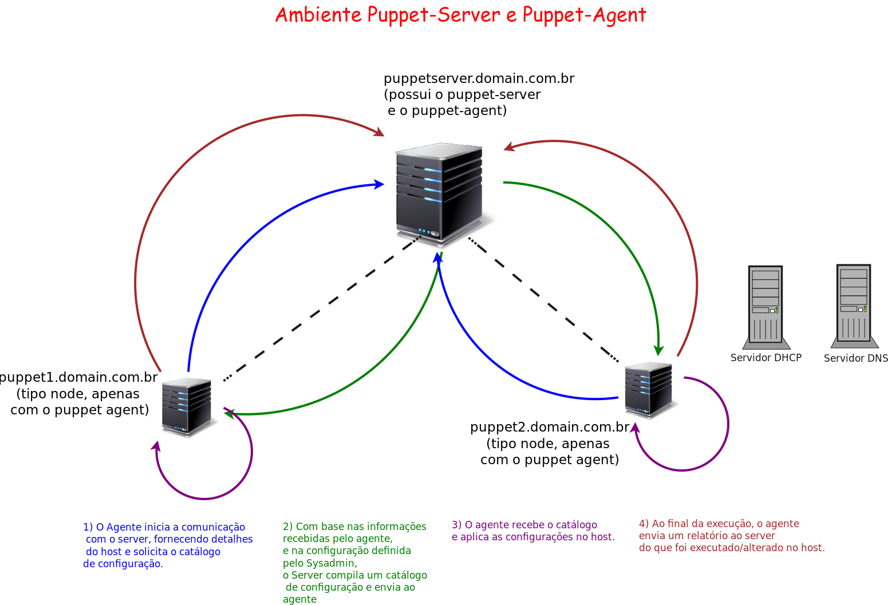

# Como Instalar e Configurar o Puppet-Server e Puppet-Agent no Debian 9.md
O Puppet fornece ferramentas para gerenciar automaticamente sua infraestrutura.

Para a arquitetura agent-master, você deve instalar o Puppet Server e opcionalmente o PuppetDB.

## Entenda o ambiente
A figura abaixo mostra o ambiente usado para a execução deste tutorial.


## Instalar Puppet Server

Adicionando o repositório da PuppetLabs no Debian 9.x:

    cd /usr/src
    wget http://apt.puppetlabs.com/puppet6-release-stretch.deb
    dpkg -i puppet6-release-stretch.deb
    apt-get update

Instalando o Puppet Server

    apt-get install -y puppet-agent puppetserver
    export PATH=/opt/puppetlabs/bin:$PATH
    echo "export PATH=/opt/puppetlabs/bin:\$PATH" >> /etc/bash.bashrc
    
Verifique a versão do Puppet com o comando abaixo.

    puppet --version

A saída do comando deve ser parecida com a abaixo:

    6.4.0

**Aviso**:

* Os binários e libs do Puppet ficam, por padrão, dentro do diretório: ```/opt/puppetlabs/bin```
* Os arquivos de configuração ficam, por padrão, dentro do diretório: ```/etc/puppetlabs/```

## Configurar o Puppet Server

No arquivo ```/etc/puppetlabs/puppet/puppet.conf``` adicione as linhas abaixo.

    [master]
    vardir = /opt/puppetlabs/server/data/puppetserver
    logdir = /var/log/puppetlabs/puppetserver
    rundir = /var/run/puppetlabs/puppetserver
    pidfile = /var/run/puppetlabs/puppetserver/puppetserver.pid
    codedir = /etc/puppetlabs/code
    
    [main]
    certname = puppetserver.domain.com.br
    server = puppetserver.domain.com.br
    environment = production
    
    [agent]
    report = true
    pluginsync = true

Altere as configurações de memória do Java a ser usado pelo Puppet Server. Edite o arquivo: ```/etc/default/puppetserver```

    JAVA_ARGS="-Xms256m -Xmx512m"

Por padrão são alocados 2GB de memória RAM para executar o Puppet Server, mas com esta configuração, será alocado  512 MB (no máximo) e 256 MB (no mínimo) para  uso exclusivo da JVM (Java Virtual Machine) usada pelo PuppetServer. Altere os valores conforme a disponibilidade de memória do servidor Puppet Server.

Em seguida reinicie o serviço

    service puppetserver restart

## Instalar Puppet Agent

Adicionando o repositório da PuppetLabs no Debian 9.x:

    cd /usr/src
    wget http://apt.puppetlabs.com/puppet6-release-stretch.deb
    dpkg -i puppet6-release-stretch.deb
    apt-get update

Instalando Puppet Agent

    apt-get -y install puppet-agent
    export PATH=/opt/puppetlabs/bin:$PATH
    echo "export PATH=/opt/puppetlabs/bin:\$PATH" >> /etc/bash.bashrc
    
## Configurar o Puppet Agent

No arquivo ```/etc/puppetlabs/puppet/puppet.conf``` de cada máquina (Puppet-Agent) adicione as linhas abaixo.

Exemplo para a máquina ```puppet1```:

    [main]
    certname = puppet1.domain.com.br
    server = puppetserver.domain.com.br
    environment = production
    
    [agent]
    report = true
    pluginsync = true
    
Exemplo para a máquina ```puppet2```:

    [main]
    certname = puppet2.domain.com.br
    server = puppetserver.domain.com.br
    environment = production
    
    [agent]
    report = true
    pluginsync = true

## Gere os certificados

Na máquina Puppet Server, o certificado é gerado automaticamente ao instalar o pacote puppet-server. Inicie o serviço Puppet Server e habilite para ser iniciado com o boot do sistema operacional usando o comando abaixo:

    puppet resource service puppetserver ensure=running enable=true

Nas máquinas que possuem apenas o puppet-agent, gere uma solicitação de assinatura de certificado com o comando abaixo.

    puppet agent -t

**No servidor Puppet-Server** aparecerá a solicitação de assinatura para cada máquina que tem apenas o Puppet-Agent. User o comando abaixo para visualizar as solicitações de assinatura do certificado.

    puppetserver ca list 
       "puppet1.domain.com.br" (SHA256) C7:EC:72:6F:82:56:9E:15:C8:42:2D:A7:07:07:B7:B6:AC:41:45:DC:33:BA:09:B5:1A:3D:2C:14:31:32:D7:D4 
       "puppet2.domain.com.br" (SHA256) 49:0D:A2:2B:7E:4B:EE:2E:85:CC:B4:16:F9:C1:56:C8:75:63:0C:EF:C4:0E:96:FA:42:4E:09:32:CB:B2:E1:FF

Assine cada certificado usando os comandos abaixo:

    puppetserver ca sign --certname puppet1.domain.com.br
    puppetserver ca sign --certname puppet2.domain.com.br
    
**Avisos:**
* As solicitações de assinatura de certificados no Puppet-Server ficam em: ```/etc/puppetlabs/puppet/ssl/ca/requests/```
* No Puppet-Agent, os certificados assinados ficam em: ```/etc/puppetlabs/puppet/ssl/```
* Se precisar refazer a assinatura de certificados no host que tem o puppet-agent é só apagar os arquivos e sub-diretórios que ficam em: ```/etc/puppetlabs/puppet/ssl/```
* Se precisar revogar os certificados assinados no PuppetServer de um host cliente (puppet1, por exemplo) é só usar o comando: ```puppet node clean puppet1.domain.com.br``` (por exemplo).
* O log do ```puppetserver``` fica em ```/var/log/puppetlabs/puppetserver/puppetserver.log``` e ```/var/log/puppetlabs/puppetserver/puppetserver-daemon.log```
* O log do ```puppet-agent fica em /var/log/syslog``` e ```/var/log/puppetlabs/puppet```.

Agora execute o comando abaixo, em cada máquina (Puppet Server e Puppet Agent). Este comando irá iniciar o ```puppet-agent``` e habilitá-lo para ser executado após o boot do sistema operacional.

    puppet resource service puppet ensure=running enable=true

## Teste o funcionamento do ambiente

No Puppet Server, crie o arquivo ```/etc/puppetlabs/code/environments/production/manifests/site.pp``` com o conteúdo abaixo:

    node "puppet1.domain.com.br" {
      package { 'nmap':
        ensure => present,
      }
    }
    node "puppet2.domain.com.br" {
      package { 'elinks':
        ensure => present,
      }
    }
    node "puppetserver.domain.com.br" {
      package { 'tcpdump':
        ensure => present,
      }
    }

Salve o arquivo e execute em todas as máquinas o comando abaixo:

    puppet agent -t

Verifique se pacotes foram realmente instalados conforme a configuração especificada no arquivo ```site.pp```.

* Na máquina ```puppet1``` deve ser instalado o pacote ```nmap```
* Na máquina ```puppet2``` deve ser instalado o pacote ```elinks```
* Na máquina ```puppetserver``` deve ser instalado o pacote ```tcpdump```

Fonte: [Aécio Pires](http://blog.aeciopires.com/configurando-um-ambiente-puppet-5/) 