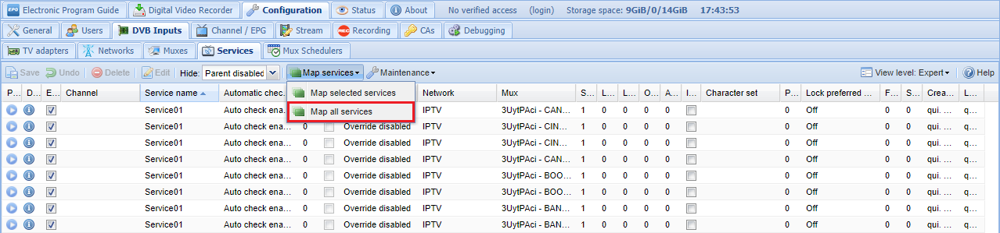

# Como instalar e configurar Tvheadend

## 1. Instalando
Para instalar o **Tvheadend** no **Ubuntu 20.04**, **Ubuntu 19.04**, **Ubuntu 18.04**, **Ubuntu 18.10**, **Ubuntu 16.04** ou superior. Inclusive você também pode instalar o **Tvheadend** no **Linux Mint** sem nenhum problema execute o comando abaixo:

```
sudo snap install tvheadend
```
E como em um passe de mágica o **Tvheadend** foi instalado.


## 2. Configurando o Tvheadend

Para configurar o servidor do **Tvheadend** acesse o endereço: `http://[IP-Address]:9981/`

O *Start Wizard* não ajuda muito então pode cancelar e seguir com as configurações manualmente.

Mesmo que você não saiba como usar a ferramenta recomendo mudar o modo de visualização para **Expert**, desta maneira será mostrada mais abas de opções para configuração.

Use o caminho `Configuration > General > Base`


## 2. Adicionando uma IPTV

Existem varias listas gratuitas e de degustação, você pode encontrar algumas opções neste link: [Lista IPTV Grátis](https://wendeltecksempre.blogspot.com/2019/12/lista-httpbit.html)

Para este exemplo vou usar a seguinte lista `m3u`: https://pastebin.com/raw/3UytPAci

Ela aparece da seguinte forma:
```
#EXTM3U
#EXTINF:-1 group-title="REALITY SHOW",A FAZENDA 12 HD 1
http://freshonyx.top:8080/Natanael/natanael/99969
#EXTINF:-1 group-title="REALITY SHOW",A FAZENDA 12 HD 2
http://freshonyx.top:8080/Natanael/natanael/99967
#EXTINF:-1 group-title="FILMES E SERIES",A&E FHD
http://freshonyx.top:8080/Natanael/natanael/98982
#EXTINF:-1 group-title="FILMES E SERIES",A&E HD*
http://freshonyx.top:8080/Natanael/natanael/99268
#EXTINF:-1 group-title="FILMES E SERIES",A&E FHD*
http://freshonyx.top:8080/Natanael/natanael/99267
#EXTINF:-1 group-title="FILMES E SERIES",A&E SD
http://freshonyx.top:8080/Natanael/natanael/98474
#EXTINF:-1 group-title="CANAIS ABERTO",AGRO CANAL HD
http://freshonyx.top:8080/Natanael/natanael/98524
#EXTINF:-1 group-title="FILMES E SERIES",AMC FHD
http://freshonyx.top:8080/Natanael/natanael/98977
#EXTINF:-1 group-title="FILMES E SERIES",AMC FHD*
http://freshonyx.top:8080/Natanael/natanael/99270
```

Para adicionar uma nova rede IPTV a cesse o seguinte caminho: `Configuration > DVB Imputs > Networks > Add` 


 
Quando for solicitado escolha `IPTV Automatic Network`.


Preencha os campos conforme a imagem abaixo:


* `Network name` - um nome a sua escolha
* `URL` -  https://pastebin.com/raw/3UytPAci

Ao final pressione o botão: `Create`

Se der tudo certo o **Tvheadend** irá começar a encontrar os **Muxes**:


Os Muxes podem ser visto em: `Configuration > DVB Imputs > Muxes`


Os canais serão populados automaticamente conforme eles forem sendo encontrados, no inicio não irão existir muitos, mais depois de rodar por pelo menos 24 horas serão muitos.

Para adicionar automaticamente utilize o caminho: `Configuration > DVB Imputs > Services > Map all services` e clique no botão `Map services`.



Depois deste processo já será possível ver os canais em: `Configuration > DVB Imputs > Services > Map all services`


A partir deste ponto o servidor já estará gerando uma playlist `m3u` que pode ser baixada através da seguinte URL: `http://server:9981/playlist`.
Substitua onde diz `server` pelo IP ou ` hostname`  do seu servidor.
 

Fonte: [SempreUpdate](https://sempreupdate.com.br/como-instalar-o-servidor-de-streaming-de-tv-tvheadend-no-ubuntu-linux-mint-fedora-debian-centos-e-opensuse/)