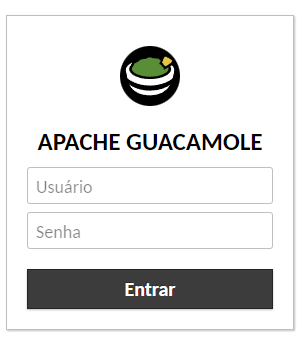
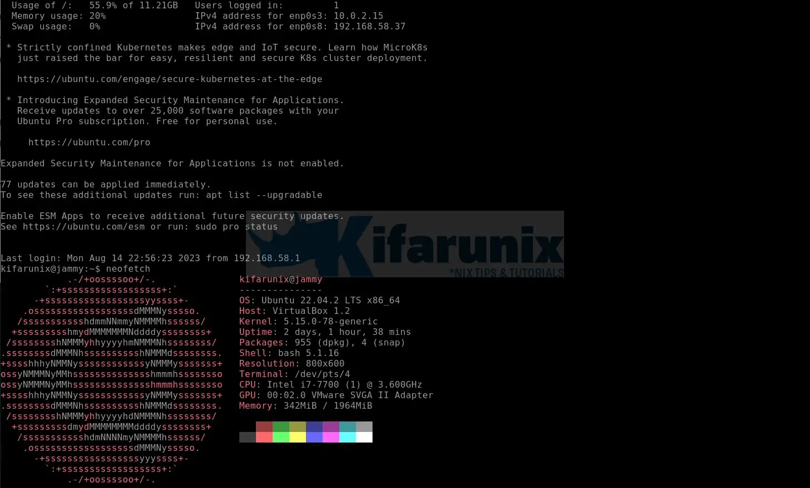
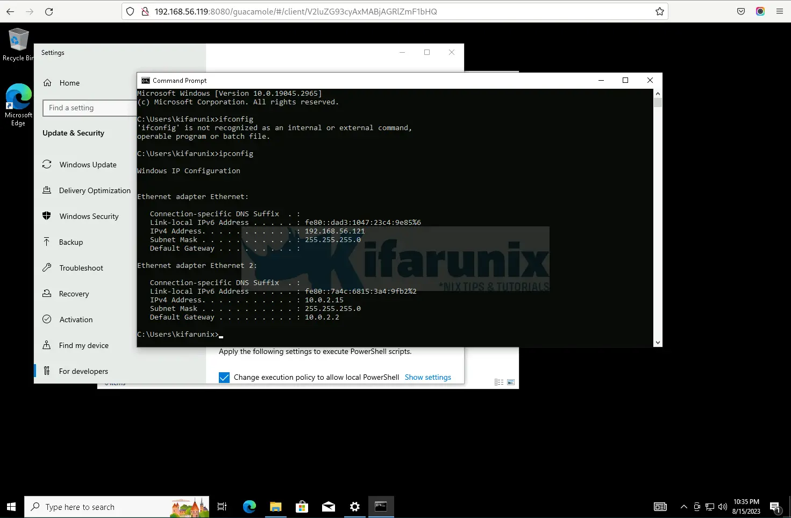

# Como instalar o Apache Guacamole no Debian 12

Este guia o guiará pelas etapas que você pode usar para instalar o Guacamole no Debian 12. O Apache Guacamole é um gateway de área de trabalho remota baseado na Web HTML5 sem cliente que fornece acesso remoto a servidores e áreas de trabalho por meio de um navegador da Web. Ele é compatível com protocolos padrão como VNC, RDP e SSH.

## Instalar o Guacamole no Debian 12
O Guacamole é composto de duas partes

- `guacamole-server`, que fornece o proxy guacd e todos os componentes nativos do lado do servidor exigidos pelo Guacamole para se conectar a áreas de trabalho remotas.
- `guacamole-client`, que fornece o cliente a ser atendido pelo contêiner de servlet, que geralmente é o Tomcat.

Você precisa instalar esses dois componentes para configurar o cliente de área de trabalho remota baseado na Web do Apache Guacamole.

### 1. Instalar o servidor Guacamole no Debian 12
#### 1.1. Execute a atualização do sistema
Certifique-se de que o cache de pacotes do sistema esteja atualizado

````shell
apt update
````

#### 1.2. Instalar as ferramentas de compilação necessárias
Para instalar o `guacamole-server`, você precisa compilá-lo a partir da fonte. Isso, portanto, exige que você instale as ferramentas de compilação necessárias antes de começar a compilar o componente `guacamole-server`

````shell
apt install -y build-essential \
    libcairo2-dev \
    libjpeg62-turbo-dev \
    libpng-dev \
    libtool-bin \
    uuid-dev \
    libossp-uuid-dev \
    libavcodec-dev \
    libavformat-dev \
    libavutil-dev \
    libswscale-dev \
    freerdp2-dev \
    libpango1.0-dev \
    libssh2-1-dev \
    libvncserver-dev \
    libtelnet-dev \
    libwebsockets-dev \
    libssl-dev \
    libvorbis-dev \
    libwebp-dev \
    libpulse-dev \
    sudo \
    vim
````

Uma descrição abrangente dessas ferramentas de dependência está disponível na seção de [dependências necessárias](https://guacamole.apache.org/doc/gug/installing-guacamole.html#required-dependencies).

#### 1.3. Download do código-fonte do Guacamole Tarball
Para instalar o Guacamole no Debian 12, nós o construiremos a partir do código-fonte. Portanto, baixe o tarball do repositório de código-fonte mais recente na [página de lançamentos do Guacamole](https://guacamole.apache.org/releases/).

O [Apache Guacamole 1.5.4](https://guacamole.apache.org/releases/1.5.4/) é a versão de lançamento mais recente até o momento em que este documento foi escrito.

Basta executar o comando abaixo para baixar o Apache Guacamole 1.5.4.

Para facilitar, basta definir uma variável para a versão de lançamento estável atual no terminal.
````shell
VER=1.5.4
````

````shell
cd /usr/src
wget https://downloads.apache.org/guacamole/$VER/source/guacamole-server-$VER.tar.gz
````

Quando o download for concluído, extraia o tarball de origem.

````shell
tar -zxvf guacamole-server-$VER.tar.gz
````

#### 1.4. Instalar o Apache Guacamole no Debian 12 
Navegue até o diretório do código-fonte do servidor guacamole

```shell
cd guacamole-server-$VER
```

Execute o script `configure` para verificar se alguma dependência necessária está faltando e para adaptar o servidor Guacamole ao seu sistema.

```shell
./configure --with-systemd-dir=/etc/systemd/system/
```

Para obter mais opções de configuração, execute `./configure --help`.

````shell
...
------------------------------------------------
guacamole-server version 1.5.4
------------------------------------------------

   Library status:

     freerdp2 ............ yes
     pango ............... yes
     libavcodec .......... yes
     libavformat.......... yes
     libavutil ........... yes
     libssh2 ............. yes
     libssl .............. yes
     libswscale .......... yes
     libtelnet ........... yes
     libVNCServer ........ yes
     libvorbis ........... yes
     libpulse ............ yes
     libwebsockets ....... yes
     libwebp ............. yes
     wsock32 ............. no

   Protocol support:

      Kubernetes .... yes
      RDP ........... yes
      SSH ........... yes
      Telnet ........ yes
      VNC ........... yes

   Services / tools:

      guacd ...... yes
      guacenc .... yes
      guaclog .... yes

   FreeRDP plugins: /usr/lib/x86_64-linux-gnu/freerdp2
   Init scripts: no
   Systemd units: /etc/systemd/system/

Type "make" to compile guacamole-server.
````

Preste atenção à saída do script `configure`. Se houver alguma dependência necessária não atendida, corrija-a antes de prosseguir.

Compile e instale o Guacamole Server no Debian 12

````shell
make
````

Se o comando `make` falhar com o erro abaixo

````shell
...
video.c: In function ‘guacenc_video_alloc’:
video.c:64:22: error: assignment discards ‘const’ qualifier from pointer target type [-Werror=discarded-qualifiers]
   64 |     container_format = container_format_context->oformat;
      |                      ^
video.c:67:22: error: initialization discards ‘const’ qualifier from pointer target type [-Werror=discarded-qualifiers]
   67 |     AVCodec* codec = avcodec_find_encoder_by_name(codec_name);
      |                      ^~~~~~~~~~~~~~~~~~~~~~~~~~~~
cc1: all warnings being treated as errors
make[2]: *** [Makefile:1126: guacenc-video.o] Error 1
make[2]: Leaving directory '/root/guacamole-server-1.5.4/src/guacenc'
make[1]: *** [Makefile:544: all-recursive] Error 1
make[1]: Leaving directory '/root/guacamole-server-1.5.4'
````

O utilitário `guacenc` é usado para traduzir gravações de tela em vídeo e depende do FFmpeg. Ele é uma dependência opcional, portanto, você pode optar por desativá-lo. Portanto, execute novamente o comando configure com a opção `--disable-guacenc`

````shell
./configure --with-systemd-dir=/etc/systemd/system/ --disable-guacenc
````

Depois disso, execute o comando make novamente.

````shell
make
````

Em seguida, instale o Guacamole

````shell
make install
````

Em seguida, execute o comando `ldconfig` para criar os links e o cache necessários para as bibliotecas compartilhadas mais recentes encontradas no diretório do servidor guacamole.

````shell
ldconfig
````

#### 1.5. Execução do servidor Guacamole no Debian 12

Recarregue os arquivos de configuração do systemd e inicie e habilite o guacd (Guacamole Daemon) para ser executado na inicialização após a instalação.

````shell
systemctl daemon-reload
````

````shell
systemctl enable --now guacd
````

Para verificar o status

````shell
systemctl status guacd
````

````shell
● guacd.service - Guacamole Server
     Loaded: loaded (/etc/systemd/system/guacd.service; enabled; preset: enabled)
     Active: active (running) since Thu 2024-03-07 14:37:35 -03; 13min ago
       Docs: man:guacd(8)
   Main PID: 29989 (guacd)
      Tasks: 1 (limit: 4644)
     Memory: 10.0M
        CPU: 28ms
     CGroup: /system.slice/guacd.service
             └─29989 /usr/local/sbin/guacd -f

mar 07 14:37:35 guacamole systemd[1]: Started guacd.service - Guacamole Server.
mar 07 14:37:35 guacamole guacd[29989]: Guacamole proxy daemon (guacd) version 1.5.4 started
mar 07 14:37:35 guacamole guacd[29989]: guacd[29989]: INFO:        Guacamole proxy daemon (guacd) version 1.5.4 started
mar 07 14:37:35 guacamole guacd[29989]: guacd[29989]: INFO:        Listening on host ::1, port 4822
mar 07 14:37:35 guacamole guacd[29989]: Listening on host ::1, port 4822
````

Se você notou, o guacd está escutando no endereço IPv6 localhost (`Listening on host ::1, port 4822`). Isso provavelmente ocorre porque seu arquivo de hosts está assim;

````shell
cat /etc/hosts
````

````shell
127.0.0.1       localhost
127.0.0.1    guacamole

# The following lines are desirable for IPv6 capable hosts
::1     localhost ip6-localhost ip6-loopback
ff02::1 ip6-allnodes
ff02::2 ip6-allrouters
````

Veja a linha acima! Se você continuar com isso, acabará não conseguindo se conectar aos seus pontos de extremidade remotos com esse erro

````shell
tomcat9[28149]: 15:47:52.938 [http-nio-8080-exec-5] ERROR o.a.g.s.GuacamoleHTTPTunnelServlet - HTTP tunnel request failed: java.net.ConnectException: Connection refused
````

Portanto, comente a linha IPv6 no arquivo hosts

````shell
sed -i '/^::1/s/^/#/g' /etc/hosts
````

Reinicie o servidor Guacamole;

````shell
systemctl restart guacd
````

Confirme o status

````shell
systemctl status guacd
````

````shell
● guacd.service - Guacamole Server
     Loaded: loaded (/etc/systemd/system/guacd.service; enabled; preset: enabled)
     Active: active (running) since Thu 2024-03-07 17:58:59 -03; 3s ago
       Docs: man:guacd(8)
   Main PID: 30059 (guacd)
      Tasks: 1 (limit: 4644)
     Memory: 10.0M
        CPU: 35ms
     CGroup: /system.slice/guacd.service
             └─30059 /usr/local/sbin/guacd -f

mar 07 17:58:59 guacamole systemd[1]: Started guacd.service - Guacamole Server.
mar 07 17:59:00 guacamole guacd[30059]: Guacamole proxy daemon (guacd) version 1.5.4 started
mar 07 17:59:00 guacamole guacd[30059]: guacd[30059]: INFO:        Guacamole proxy daemon (guacd) version 1.5.4 started
mar 07 17:59:00 guacamole guacd[30059]: guacd[30059]: INFO:        Listening on host 127.0.0.1, port 4822
mar 07 17:59:00 guacamole guacd[30059]: Listening on host 127.0.0.1, port 4822
````

````shell
ss -altnp | grep :4822
````

````shell
LISTEN 0      5          127.0.0.1:4822      0.0.0.0:*    users:(("guacd",pid=30059,fd=4))
````

### 2. Instalar Tomcat Servlet

O Apache Tomcat é usado para servir o conteúdo do cliente guacamole aos usuários que se conectam ao servidor guacamole por meio do navegador da Web. Para instalar o Tomcat 9 no Debian 12, você pode compilá-lo a partir do repositório ou instalá-lo a partir dos repositórios do Debian 11. Isso ocorre porque o Debian 12 vem com o Tomcat 10 por padrão. O Guacamole ainda não é compatível com o Tomcat 10.

#### 2.1. Instalar o Tomcat 9 no Debian 12 compilando a partir do repositório
Siga o link abaixo para saber como instalar o Tomcat 9 no Debian 12 construindo a partir do repositório do Tomcat.

[Como instalar o Tomcat 9 no Debian 12](Como%20instalar%20o%20Tomcat%209%20no%20Debian%2012.md)

#### 2.1. Instalar o Tomcat 9 no Debian 12 a partir dos repositórios do Debian 11
Instale temporariamente os repositórios do Debian 11 da seguinte forma;

````shell
echo "deb http://deb.debian.org/debian/ bullseye main" > /etc/apt/sources.list.d/bullseye.list
````

Em seguida, instale o Tomcat9

````shell
apt update
````

````shell
apt install tomcat9 tomcat9-admin tomcat9-common tomcat9-user -y
````

Remova os repositórios do Debian 11

````shell
sed -i 's/^/#/' /etc/apt/sources.list.d/bullseye.list
````

O Tomcat9 é iniciado e habilitado para execução na inicialização do sistema após a instalação. Verifique o status executando o comando abaixo

```shell
systemctl status tomcat9.service
```

````shell
● tomcat9.service - Apache Tomcat 9 Web Application Server
     Loaded: loaded (/lib/systemd/system/tomcat9.service; enabled; preset: enabled)
     Active: active (running) since Thu 2024-01-11 11:11:34 EST; 34s ago
       Docs: https://tomcat.apache.org/tomcat-9.0-doc/index.html
    Process: 24423 ExecStartPre=/usr/libexec/tomcat9/tomcat-update-policy.sh (code=exited, status=0/SUCCESS)
   Main PID: 24427 (java)
      Tasks: 30 (limit: 1099)
     Memory: 107.3M
        CPU: 3.672s
     CGroup: /system.slice/tomcat9.service
             └─24427 /usr/lib/jvm/default-java/bin/java -Djava.util.logging.config.file=/var/lib/tomcat9/conf/logging.properties -Djava.util.logging.manager=org.apache.juli.ClassLoaderLogManager ->

Jan 11 11:11:35 debian tomcat9[24427]: Deployment of deployment descriptor [/etc/tomcat9/Catalina/localhost/manager.xml] has finished in [569] ms
Jan 11 11:11:35 debian tomcat9[24427]: Deploying deployment descriptor [/etc/tomcat9/Catalina/localhost/host-manager.xml]
Jan 11 11:11:35 debian tomcat9[24427]: The path attribute with value [/host-manager] in deployment descriptor [/etc/tomcat9/Catalina/localhost/host-manager.xml] has been ignored
Jan 11 11:11:36 debian tomcat9[24427]: At least one JAR was scanned for TLDs yet contained no TLDs. Enable debug logging for this logger for a complete list of JARs that were scanned but no TLDs w>
Jan 11 11:11:36 debian tomcat9[24427]: Deployment of deployment descriptor [/etc/tomcat9/Catalina/localhost/host-manager.xml] has finished in [306] ms
Jan 11 11:11:36 debian tomcat9[24427]: Deploying web application directory [/var/lib/tomcat9/webapps/ROOT]
Jan 11 11:11:36 debian tomcat9[24427]: At least one JAR was scanned for TLDs yet contained no TLDs. Enable debug logging for this logger for a complete list of JARs that were scanned but no TLDs w>
Jan 11 11:11:36 debian tomcat9[24427]: Deployment of web application directory [/var/lib/tomcat9/webapps/ROOT] has finished in [315] ms
Jan 11 11:11:36 debian tomcat9[24427]: Starting ProtocolHandler ["http-nio-8080"]
Jan 11 11:11:36 debian tomcat9[24427]: Server startup in [1220] milliseconds
````

O Apache Tomcat escuta na porta `8080/tcp` por padrão

````shell
ss -altnp | grep :8080
````

````shell
LISTEN 0      100                *:8080            *:*    users:(("java",pid=24427,fd=37))
````

Para permitir o acesso externo ao serverlet, abra a porta `8080/tcp` do serverlet no UFW, se o UFW estiver instalado e ativado.

````shell
ufw allow 8080/tcp
````

### 3. Instalar o cliente Guacamole no Debian 12

O `guacamole-client` contém um aplicativo da Web que servirá o cliente Guacamole HTML5 aos usuários que se conectarem ao seu servidor. Em seguida, o aplicativo da Web se conectará ao `guacd` em nome dos usuários conectados para fornecer a eles qualquer área de trabalho remota que estejam autorizados a acessar.

#### 3.1 Faça download e instale o binário do cliente Guacamole

Crie o diretório de configuração do Guacamole

````shell
mkdir /etc/guacamole
````

O cliente Guacamole pode ser instalado a partir do código-fonte ou do binário pronto. A instalação do binário é usada nesta demonstração.

Faça o download do Guacamole-client na [página de lançamentos do Guacamole](https://guacamole.apache.org/releases/) para a respectiva versão mais recente (v1.5.4 no momento em que este documento é escrito) e armazene-o no diretório de configuração criado acima.

Para fazer o download da versão atual, v1.5.4, basta executar o comando abaixo;

Da mesma forma, usamos a mesma variável de versão do cliente;

````shell
VER=1.5.4
````

````shell
wget \
https://downloads.apache.org/guacamole/$VER/binary/guacamole-$VER.war \
-O /etc/guacamole/guacamole.war
````

Crie um link simbólico do cliente guacamole para o diretório Tomcat `webapps`, conforme mostrado abaixo;

````shell
ln -s /etc/guacamole/guacamole.war /var/lib/tomcat9/webapps/
````

Se você criar o Tomcat a partir do código-fonte do Tomcat, então

````shell
ln -s /etc/guacamole/guacamole.war /opt/tomcat9/webapps/
````

Reinicie o Tomcat e o servidor Guacamole para implantar o novo aplicativo da Web

````shell
systemctl restart tomcat9 guacd
````

### 4. Configurar o Apache Guacamole no Debian 12

O Guacamole tem dois arquivos de configuração principais;

* `/etc/guacamole`, que é referenciado pela variável de ambiente `GUACAMOLE_HOME`
* `/etc/guacamole/guacamole.properties`, que é o principal arquivo de configuração usado pelo Guacamole e suas extensões.
* 
Há também configurações de extensões e bibliotecas do Guacamole. Você precisa criar os diretórios para essas configurações

````shell
mkdir /etc/guacamole/{extensions,lib}
````

Defina a variável de ambiente do diretório inicial do guacamole e adicione-a ao arquivo de configuração `/etc/default/tomcat9`.

````shell
echo "GUACAMOLE_HOME=/etc/guacamole" >> /etc/default/tomcat9
````

Se você criou o Tomcat a partir do código-fonte do Tomcat, então

````shell
echo "GUACAMOLE_HOME=/etc/guacamole" >> /etc/profile.d/tomcat9.sh
````

#### 4.1. Configurar as conexões do servidor do Guacamole

Para definir como o Guacamole se conecta ao `guacd`, crie o arquivo `guacamole.properties` no diretório `/etc/guacamole` com o seguinte conteúdo.

````shell
cat > /etc/guacamole/guacamole.properties << EOL
guacd-hostname: 127.0.0.1
guacd-port: 4822
user-mapping:   /etc/guacamole/user-mapping.xml
auth-provider:  net.sourceforge.guacamole.net.basic.BasicFileAuthenticationProvider
EOL
````

A configuração acima é explicada a seguir;

1. `guacd-hostname: localhost`: Essa linha define o nome do host do daemon do Guacamole (`guacd`) como "localhost". O daemon do Guacamole é responsável por lidar com conexões de área de trabalho remota.
1. `guacd-port: 4822`: Essa linha especifica o número da porta (`4822`) na qual o daemon do Guacamole (`guacd`) está escutando conexões.
1. `user-mapping: /etc/guacamole/user-mapping.xml`: Essa linha especifica o caminho para o arquivo de configuração de mapeamento de usuários (`user-mapping.xml`). Esse arquivo define como os usuários são autenticados e quais conexões de área de trabalho remota eles podem acessar.
1. `auth-provider: net.sourceforge.guacamole.net.basic.BasicFileAuthenticationProvider`: Essa linha define o provedor de autenticação a ser usado para a autenticação do usuário. Nesse caso, é usado o BasicFileAuthenticationProvider, o que significa que a autenticação será baseada nas credenciais de usuário definidas no arquivo `user-mapping.xml`.

Em seguida, vincule o diretório de configurações do Guacamole ao diretório de servlets do Tomcat, conforme mostrado abaixo.

````shell
ln -s /etc/guacamole /usr/share/tomcat9/.guacamole
````

Da mesma forma, se você criou o Tomcat a partir do código-fonte do Tomcat, então

````shell
ln -s /etc/guacamole /opt/tomcat9/.guacamole
````

#### 4.2. Configurar o método de autenticação do Guacamole

Há diferentes métodos de autenticação compatíveis com o Guacamole;

* Leitura de credenciais do arquivo XML (_padrão_).
* Autenticação de banco de dados
* Autenticação LDAP
* Recuperação de segredos de um cofre
* Autenticação de dois fatores Duo
* Autenticação de dois fatores TOTP
* Autenticação de cabeçalho HTTP
* Autenticação JSON criptografada
* Autenticação CAS
* Autenticação OpenID Connect
* Autenticação SAML
* Autenticação RADIUS

* O método de autenticação padrão do Guacamole lê todos os usuários e conexões de um único arquivo chamado `user-mapping.xml`. Ativamos a autenticação básica na configuração acima.

Nesse arquivo, você precisa definir os **usuários autorizados a acessar a interface do usuário da Web do Guacamole, os servidores aos quais se conectar e o método de conexão**.

>OBSERVAÇÃO: o armazenamento de informações confidenciais, como senhas ou detalhes de conexão em texto simples no arquivo `user-mapping.xml`, pode ser um risco à segurança, especialmente se o arquivo estiver acessível a usuários não autorizados. Se estiver usando o Guacamole Over Internet, recomendo que evite o uso do arquivo `user-mapping.xml` para armazenar credenciais. Além disso, certifique-se de que o HTTPS esteja implementado. A segurança começa com você!

Você pode optar por usar outros métodos de autenticação abaixo;

* [Configurar a autenticação de dois fatores TOTP no Apache Guacamole](https://kifarunix.com/configure-totp-two-factor-authentication-on-apache-guacamole/)
* [Configurar a autenticação do banco de dados MySQL do Guacamole](https://kifarunix.com/configure-guacamole-mysql-database-authentication/)
* [Configurar a autenticação OpenLDAP do Apache Guacamole]()

No entanto, para fins de teste local, usaremos esse método!

Para começar, gere o hash MD5 de senhas para o usuário a ser usado para fazer login na interface de usuário da Web do Guacamole.

**Substitua sua senha,** `<password>`, **de acordo**

````shell
echo -n <senha> | openssl md5
````

Por exemplo, onde **senha** é minha senha.

````shell
echo -n password | openssl md5
````

Saída

````shell
MD5(stdin)= 5f4dcc3b5aa765d61d8327deb882cf99
````

Certifique-se de substituir a **senha** por sua senha forte.

Em seguida, crie o arquivo de autenticação de usuário padrão, `user-mapping.xml`, com o seguinte conteúdo.

````shell
vim /etc/guacamole/user-mapping.xml
````

````xml
<user-mapping>
        
    <!-- Per-user authentication and config information -->

    <!-- A user using md5 to hash the password
         guacadmin user and its md5 hashed password below is used to 
             login to Guacamole Web UI-->
    <authorize 
            username="guacadmin"
            password="5f4dcc3b5aa765d61d8327deb882cf99"
            encoding="md5">

        <!-- First authorized Remote connection -->
        <connection name="Ubuntu 22">
            <protocol>ssh</protocol>
            <param name="hostname">192.168.58.37</param>
            <param name="port">22</param>
        </connection>

        <!-- Second authorized remote connection -->
        <connection name="Windows 10">
            <protocol>rdp</protocol>
            <param name="hostname">192.168.56.121</param>
            <param name="port">3389</param>
            <param name="username">kifarunix</param>
            <param name="ignore-cert">true</param>
        </connection>

    </authorize>

</user-mapping>
````

Se você não especificar o nome de usuário e a senha no arquivo, será solicitado a fornecê-los ao tentar fazer login, o que considero um pouco seguro.

Se precisar definir explicitamente os nomes de usuário e as senhas no arquivo de configuração, adicione os parâmetros;

````xml
<param name="username">USERNAME</param>
<param name="password">PASSWORD</param>
````

Salve e saia do arquivo de configuração.

Reinicie o Tomcat e o guacd para efetivar as alterações.

````shell
systemctl restart tomcat9 guacd
````

Verifique se há algum problema nos arquivos de registro syslog, `/var/log/syslog` ou `/var/log/tomcat9/`.


### 5. Acesso ao Apache Guacamole a partir do navegador

O servidor Apache Guacamole está agora configurado. Você pode acessá-lo pelo navegador da Web usando o endereço http://server-IP:8080/guacamole.



Use as credenciais do usuário para o qual você gerou um hash MD5 para a senha acima.

Após o login bem-sucedido, você acessará o painel da Web do Apache Guacamole e poderá ver as conexões adicionadas.


Clique no nome de uma conexão para iniciar o login remoto.

Por exemplo, para fazer ssh no servidor Ubuntu 22, basta clicar no nome da conexão. Isso fará com que você receba um prompt de login



Para fazer login no Windows 10 via RDP, basta clicar em Windows 10, inserir as credenciais de login e ir para a área de trabalho.



### 6. Configurar o Apache Guacamole com HTTPS

Siga o guia abaixo para saber como configurar o Apache Guacamole com HTTPS

[Configurar o Guacamole SSL/TLS com o proxy reverso do Nginx](https://kifarunix.com/configure-guacamole-ssl-tls-with-nginx-reverse-proxy/)

## Como corrigir a conexão fechada/recusada do servidor RDP: Falha na negociação de segurança (tipo de segurança incorreto?)

Se você encontrar o **ERRO DE CONEXÃO** e verificar os registros;

````shell
journalctl -f -u guacd
````

````shell
Aug 15 16:31:53 debian guacd[28423]: Loading keymap "en-us-qwerty"
Aug 15 16:31:53 debian guacd[28423]: guacd[28423]: INFO:        Loading keymap "en-us-qwerty"
Aug 15 16:31:53 debian guacd[28423]: RDP server closed/refused connection: Security negotiation failed (wrong security type?)
Aug 15 16:31:53 debian guacd[28423]: guacd[28423]: INFO:        RDP server closed/refused connection: Security negotiation failed (wrong security type?)
Aug 15 16:31:53 debian guacd[28423]: guacd[28423]: INFO:        User "@7de1f381-34cf-4e08-8df0-66a5048c6f65" disconnected (0 users remain)
Aug 15 16:31:53 debian guacd[28423]: guacd[28423]: INFO:        Last user of connection "$c9f11e3a-cc25-40c9-b6d2-c015773f7262" disconnected
Aug 15 16:31:53 debian guacd[28423]: User "@7de1f381-34cf-4e08-8df0-66a5048c6f65" disconnected (0 users remain)
Aug 15 16:31:53 debian guacd[28423]: Last user of connection "$c9f11e3a-cc25-40c9-b6d2-c015773f7262" disconnected
Aug 15 16:31:53 debian guacd[28360]: Connection "$c9f11e3a-cc25-40c9-b6d2-c015773f7262" removed.
Aug 15 16:31:53 debian guacd[28360]: guacd[28360]: INFO:        Connection "$c9f11e3a-cc25-40c9-b6d2-c015773f7262" removed.
````

````shell
Aug 15 16:31:53 debian guacd[28423]: RDP server closed/refused connection: Security negotiation failed (wrong security type?)
````

Em seguida, corrija-o da seguinte forma;

O serviço do servidor Guacamole (`guacd`) é executado como `daemon` de usuário por padrão.


````shell
ps aux | grep -v grep| grep guacd
````

````shell
daemon     28360  0.0  0.7 247892 15548 ?        Ss   16:29   0:00 /usr/local/sbin/guacd -f
````

Crie uma conta de usuário do sistema `guacd` que possa ser usada para executar o guacd em vez de executá-lo como usuário `daemon`.

````shell
useradd -M -d /var/lib/guacd/ -r -s /sbin/nologin -c "Guacd User" guacd
````

````shell
mkdir /var/lib/guacd
````

````shell
chown -R guacd: /var/lib/guacd
````

Em seguida, atualize o usuário do serviço Guacd

````shell
sed -i 's/daemon/guacd/' /etc/systemd/system/guacd.service
````

Recarregar o daemon systemd

````shell
systemctl daemon-reload
````

Reinicie o serviço Guacd

````shell
systemctl restart guacd
````

Nesse ponto, o RDP deve funcionar sem problemas.

Agora você pode adicionar mais conexões ao seu Guacamole. Consulte a [página de conexões do Guacamole](https://guacamole.apache.org/doc/gug/configuring-guacamole.html#connection-configuration) para saber como configurar. Isso marca o fim do nosso guia sobre como instalar o Guacamole no Debian 12.


Fontes: [linode](https://www.linode.com/docs/guides/installing-apache-guacamole-on-ubuntu-and-debian/), [kifarunix](https://kifarunix.com/how-to-install-guacamole-on-debian-12/)