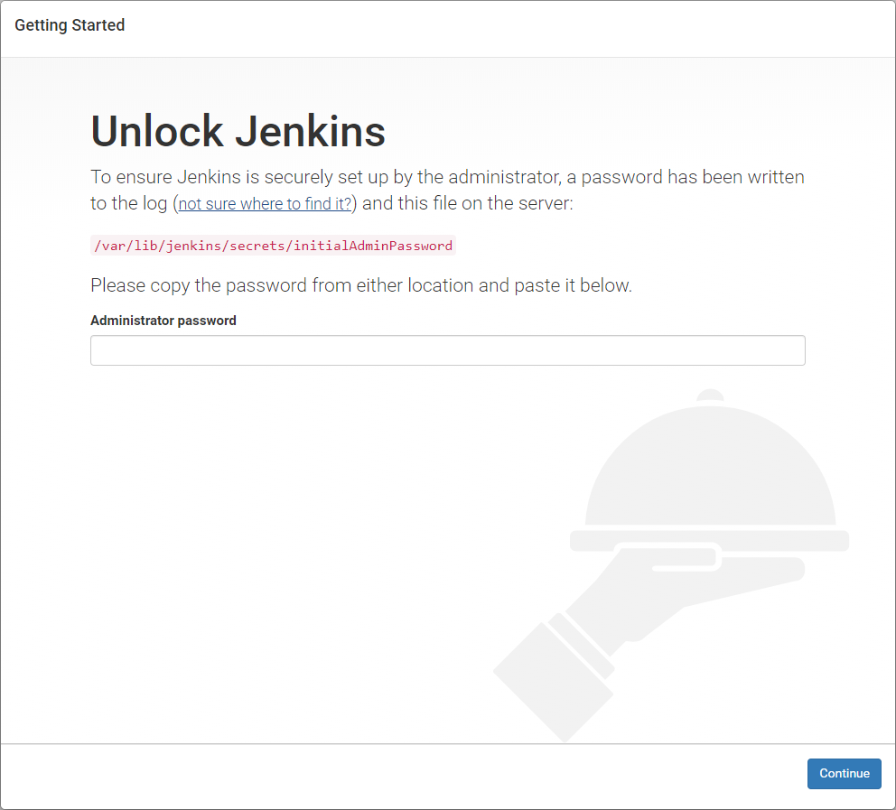

# Comp instalar o Jenkins no Debian 9

Jenkins é um servidor de automação extensível de código aberto que pode ser usado como um simples servidor de CI (Continuous Integration) ou como um CD (Continuous Delivery). Neste tutorial nos iremos mostrar a você como instalar o Jenkins em um Linux VPS rodando Debiian 9 como sistema operacional.

## Pré-requisitos:

### Instalar o OpenJDK da versão java

#### Instalando o JRE

O Java Runtime Environment normalmente vem pré-instalado na instalação padrão do Debian 9. Contudo, se você não tiver ele pré-instalado, você pode instalá-lo facilmente através do ```apt-get``` e o repositório pré instalado.

Para instalar o Java Runtime Environment, apenas execute o comando abaixo:

    apt-get install default-jre

#### Instalando o JDK
O JDK não é pré-instalado no Debian 9 por padrão. Para instalar o Java Developer Kit (JDK), execute este comando:

    apt-get install default-jdk


## Instalar Jenkins

Para instalar o Jenkins no seu servidor rodando Debian 9 como sistema operacional, você precisa ter acesso ao ```root```. Se você tem acesso ao ```root``` do servidor, você deve se conectar por SSH e atualize os programas para a última versão disponível com o seguinte comando:

    apt-get update
    apt-get upgrade
    
Isto irá atualizar o índice de pacotes e irá atualizar o programa para para a última versão disponível.

Próximo nos iremos instalar a versão LTS estável do Jenkins então nos devemos adicionar o repositório apropriado. Rode o comando abaixo para fazer isto.

    wget -q -O - https://pkg.jenkins.io/debian/jenkins.io.key | apt-key add -
    sh -c 'echo deb http://pkg.jenkins.io/debian-stable binary/ > /etc/apt/sources.list.d/jenkins.list'

Uma vez adicionado o repositório atualize o índice de pacotes novamente:

    apt-get update

Finalmente, instale o Jenkins rodando o comando abaixo:

    apt-get install jenkins

## Gerenciar Jenkins

Agora que a instalação do Jenkins esta completa, é bom saber como você pode gerenciar o serviço Jenkins. Para iniciar o serviço Jenkins rode o seguinte comando no terminal:

     systemctl start jenkins.service

Para parar o serviço Jenkins, você pode usar o seguinte comando:

    systemctl stop jenkins.service

Para reiniciar o serviço, você pode rodar o seguinte comando:

    systemctl restart jenkins.service

Para verificar o estado do serviço Jenkins, rode o seguinte comando:

    systemctl status jenkins.service

Se o Jenkins esta de pé e rodando no seu Linux no momento, a saída será parecida com a abaixo:

    ● jenkins.service - LSB: Start Jenkins at boot time
       Loaded: loaded (/etc/init.d/jenkins; generated; vendor preset: enabled)
       Active: active (exited) since Thu 2019-04-11 16:50:57 -03; 35min ago
         Docs: man:systemd-sysv-generator(8)
    
    abr 11 16:50:55 jenkins systemd[1]: Starting LSB: Start Jenkins at boot time..
    abr 11 16:50:55 jenkins jenkins[8585]: Correct java version found
    abr 11 16:50:55 jenkins su[8615]: Successful su for jenkins by root
    abr 11 16:50:55 jenkins su[8615]: + ??? root:jenkins
    abr 11 16:50:55 jenkins su[8615]: pam_unix(su:session): session opened for use
    abr 11 16:50:57 jenkins jenkins[8585]: Starting Jenkins Automation Server: jen
    abr 11 16:50:57 jenkins systemd[1]: Started LSB: Start Jenkins at boot time.

Para habilitar o serviço Jenkins na inicialização do Debian, rode o seguinte comando:

    systemctl enable jenkins.service

Caso você queira desabilitar o Jenkins do processo de ininicalização, rode o seguinte comando:

    systemctl disable jenkins.service

## Acessar e Configurar

Jenkins por padrão escuta na porta ```8080```. Se você tem outro serviço ouvindo nesta porta, Jenkins irá falhar para iniciar. Caso você precise editar o arquivo ```/etc/default/jenkins```.

Substitua a linha:

    ----HTTP_PORT=8080----

por

    ----HTTP_PORT=8081----

Onde ```8081``` é o número da porta onde você quer que o Jenkins escute. Então reinicie o Jenkins.

    systemctl restart jenkins.service

Agora o navegador e acesse a interface web do Jenkins digitando o endereço IP do servidor seguido pelo número da porta. A página será similar com a imagem abaixo:



Se for isso que você estiver vendo na tela, isto significa que você precisa desbloquear o Jenkins. Você pode encontrar a senha para desbloquear o Jenkins no arquivo ```/var/lib/jenkins/secrets/initialAdminPassword```.

    cat /var/lib/jenkins/secrets/initialAdminPassword

Informe a senha e clique em **Continue**. Agora você pode continuar e instalar os plugins necessários para os seus projetos.

Um bom ponto de partida é ler o [manual do usuário](https://jenkins.io/doc/) do Jenkins onde você pode encontar várias instruções e exemplos de uso. 

## Rodando Jenkins na porta 80

Como não existe maneira de fazer com que o Jenkins rode diretamente na porta 80, faremos o Jenkins rodar na porta 80 através do Proxy Reverso no Nginx.

Nginx é muito leve e ele pode agir como um melhor proxy reverso para o Jenkins. Siga os passos dados abaixo para rodar o Jenkins atrás de um proxy reverso do Nginx.

1. Instalando Nginx

        apt-get install nginx

1. Abra o arquivo de configuração.

        vi /etc/nginx/nginx.conf

1. Encontre a seguinte parte no arquivo ```/etc/nginx/sites-available/default```.

         location / {
         }
1. Comente a linha ```try_files $uri $uri/ =404;``` ficando assim:

        # try_files $uri $uri/ =404;

1. Adicione as seguintes linhas entre as chaves:

        proxy_pass http://127.0.0.1:8080;
        proxy_redirect off;
        proxy_set_header Host $host;
        proxy_set_header X-Real-IP $remote_addr;
        proxy_set_header X-Forwarded-For $proxy_add_x_forwarded_for;
        proxy_set_header X-Forwarded-Proto $scheme;

1. Reinicie o servidor Nginx.

        systemctl restart nginx


Fontes: [RoseHosting](https://www.rosehosting.com/blog/how-to-install-jenkins-on-debian-9/), [devops](https://devopscube.com/access-run-jenkins-port-80/)