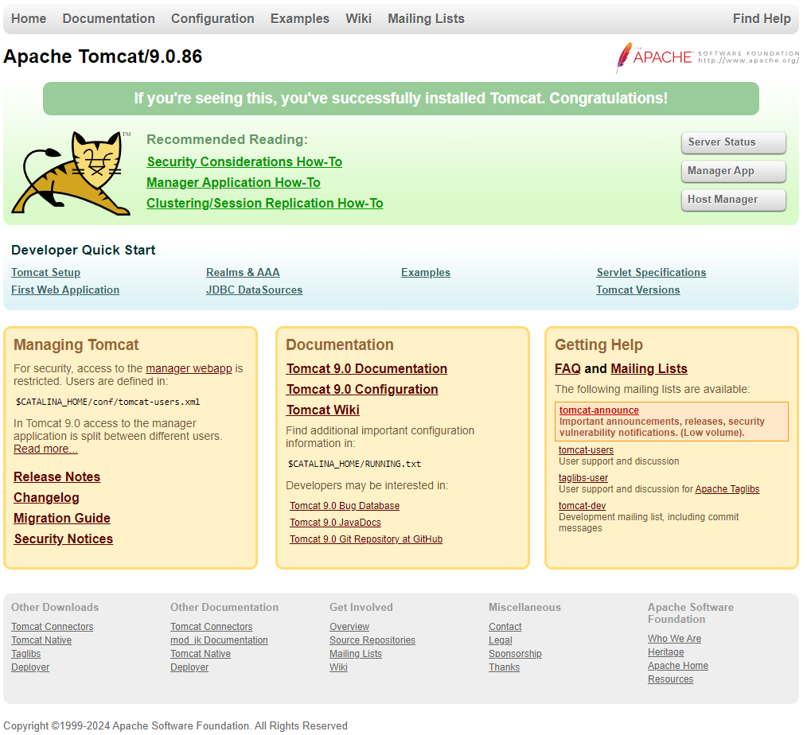

# Como Instalar o Tomcat 9 no Debian 12

Como posso instalar o Apache Tomcat 9 no Debian 12? Este guia fornece um tutorial passo a passo sobre como você pode instalar o Tomcat 9 no Debian 12. O Apache Tomcat implementa as especificações Java Servlet e JavaServer Pages (JSP)
da Oracle e fornece um ambiente de servidor da Web HTTP "Java puro" para a execução de código Java.

O Apache Tomcat 10 é a versão padrão atual do Apache Tomcat que está disponível no Debian 12. Se você estiver executando algum aplicativo baseado em Java no Debian 12 que requer o Apache Tomcat 9, este tutorial fornecerá as etapas necessárias para instalar o Tomcat 9 no Debian 12.

## 1. Instalar as Dependências de Pacotes Necessárias
O Tomcat9 requer um kit de desenvolvimento Java. Você pode instalar o JDK 11 ou uma versão posterior. Neste guia, usaremos o OpenJDK 17, que é a versão padrão fornecida pelos repositórios do Debian 12. Portanto, execute o comando abaixo para instalar o OpenJDK 17 no Debian 12;

````shell
apt update
````

````shell
apt install openjdk-17-jdk
````

Confirme a versão

````shell
java -version
````

## 2. Criar Usuário do Sistema Tomcat
Assim como qualquer outro servidor da Web, o Apache Tomcat não deve ser executado com um usuário privilegiado. Portanto, crie um usuário de sistema para o Apache Tomcat da seguinte forma (definimos o diretório inicial desse usuário como `/opt/tomcat9`);

````shell
useradd -r -d /opt/tomcat9 -s /bin/false tomcat
````


Crie o diretório inicial do usuário do tomcat

````shell
mkdir /opt/tomcat9
````

## 3. Baixando Arquivo do Apache Tomcat 9
Em seguida, navegue até a [página de downloads do Apache Tomcat 9](https://tomcat.apache.org/download-90.cgi) e faça o download do arquivo do Tomcat 9.

A versão atual do Apache Tomcat 9 é v9.0.86.

Você pode substituir o valor da variável VER abaixo pela versão atual do Apache Tomcat 9.

````shell
VER=9.0.86
````

````shell
cd /usr/src
wget https://dlcdn.apache.org/tomcat/tomcat-9/v${VER}/bin/apache-tomcat-${VER}.tar.gz
````

## 4. Instalar o Apache Tomcat 9 no Debian 12
Extraia o binário do Apache Tomcat 9 para o diretório `/opt/tomcat9`.

````shell
tar -zxvf apache-tomcat-${VER}.tar.gz -C /opt/tomcat9 --strip-components=1
````

Confirme o conteúdo do diretório inicial do Apache Tomcat

````shell
ls -alh1 /opt/tomcat9/
````

````shell
total 160K
drwxr-xr-x 9 root root 4,0K mar  7 20:24 .
drwxr-xr-x 3 root root 4,0K mar  7 20:16 ..
drwxr-x--- 2 root root 4,0K mar  7 20:24 bin
-rw-r----- 1 root root  21K fev 14 05:15 BUILDING.txt
drwx------ 2 root root 4,0K fev 14 05:15 conf
-rw-r----- 1 root root 6,1K fev 14 05:15 CONTRIBUTING.md
drwxr-x--- 2 root root 4,0K mar  7 20:24 lib
-rw-r----- 1 root root  56K fev 14 05:15 LICENSE
drwxr-x--- 2 root root 4,0K fev 14 05:15 logs
-rw-r----- 1 root root 2,3K fev 14 05:15 NOTICE
-rw-r----- 1 root root 3,3K fev 14 05:15 README.md
-rw-r----- 1 root root 6,8K fev 14 05:15 RELEASE-NOTES
-rw-r----- 1 root root  17K fev 14 05:15 RUNNING.txt
drwxr-x--- 2 root root 4,0K mar  7 20:24 temp
drwxr-x--- 7 root root 4,0K fev 14 05:15 webapps
drwxr-x--- 2 root root 4,0K fev 14 05:15 work
````

Certifique-se de que o usuário `tomcat` seja o proprietário dos diretórios `work`, `temp`, `webapps` e `logs`;

````shell
chown -R tomcat: /opt/tomcat9/{logs,temp,webapps,work}
````

Em seguida, você precisa definir a propriedade de grupo do restante dos arquivos/diretórios no diretório do Tomcat 9 como `tomcat`.

````shell
chown -R :tomcat /opt/tomcat9/
````

Atribua ao grupo `tomcat` as permissões de leitura no diretório de arquivos de configuração do Tomcat 9.

````shell
chmod -R g+r /opt/tomcat9/conf
````

Em seguida, atribua ao proprietário do grupo as permissões de execução no diretório de arquivos de configuração do Tomcat 9.

````shell
chmod g+x /opt/tomcat9/conf
````

## 5. Configurar as Variáveis de Ambiente do Apache Tomcat 9
As variáveis de ambiente são usadas pelos scripts de inicialização do Tomcat para preparar o comando que inicia o Tomcat.

Para começar, defina a variável de ambiente CATALINA_HOME como o diretório do Tomcat criado acima, onde existem os arquivos binários.

````shell
echo 'export CATALINA_HOME="/opt/tomcat9"' > /etc/profile.d/tomcat9.sh
````

Além disso, é necessário definir a variável de ambiente JRE_HOME (JRE) ou JAVA_HOME (JDK) para a versão do Java que você instalou.

Você pode encontrar o caminho com o comando `update-java-alternatives`.

````shell
update-java-alternatives -l
````

````shell
java-1.17.0-openjdk-amd64      1711       /usr/lib/jvm/java-1.17.0-openjdk-amd64
````

Ficando assim

````shell
echo 'export JAVA_HOME="/usr/lib/jvm/java-1.17.0-openjdk-amd64"' >> /etc/profile.d/tomcat9.sh 
````

Recarregue as variáveis de ambiente definidas acima.

````shell
source /etc/profile.d/tomcat9.sh
````

## 6. Configurar contas de gerenciamento da Web do Tomcat
Se desejar administrar o Apache Tomcat a partir da Web, você poderá definir um usuário para o gerenciamento na Web das interfaces de usuário Admin/Manager do Tomcat 9. Isso pode ser feito editando o arquivo `/opt/tomcat9/conf/tomcat-users.xml` e atualizando o nome de usuário, a senha e as funções específicas entre as tags `<tomcat-users>` e `</tomcat-users>`.

````shell
vim /opt/tomcat9/conf/tomcat-users.xml
````

````xml
<?xml version="1.0" encoding="UTF-8"?>
<!--
  Licensed to the Apache Software Foundation (ASF) under one or more
  contributor license agreements.  See the NOTICE file distributed with
  this work for additional information regarding copyright ownership.
  The ASF licenses this file to You under the Apache License, Version 2.0
  (the "License"); you may not use this file except in compliance with
  the License.  You may obtain a copy of the License at

      http://www.apache.org/licenses/LICENSE-2.0

  Unless required by applicable law or agreed to in writing, software
  distributed under the License is distributed on an "AS IS" BASIS,
  WITHOUT WARRANTIES OR CONDITIONS OF ANY KIND, either express or implied.
  See the License for the specific language governing permissions and
  limitations under the License.
-->
<tomcat-users xmlns="http://tomcat.apache.org/xml"
              xmlns:xsi="http://www.w3.org/2001/XMLSchema-instance"
              xsi:schemaLocation="http://tomcat.apache.org/xml tomcat-users.xsd"
              version="1.0">
<!--
  By default, no user is included in the "manager-gui" role required
  to operate the "/manager/html" web application.  If you wish to use this app,
  you must define such a user - the username and password are arbitrary.

  Built-in Tomcat manager roles:
    - manager-gui    - allows access to the HTML GUI and the status pages
    - manager-script - allows access to the HTTP API and the status pages
    - manager-jmx    - allows access to the JMX proxy and the status pages
    - manager-status - allows access to the status pages only

  The users below are wrapped in a comment and are therefore ignored. If you
  wish to configure one or more of these users for use with the manager web
  application, do not forget to remove the <!.. ..> that surrounds them. You
  will also need to set the passwords to something appropriate.
-->
<!--
  <user username="admin" password="<must-be-changed>" roles="manager-gui"/>
  <user username="robot" password="<must-be-changed>" roles="manager-script"/>
-->
<!--
  The sample user and role entries below are intended for use with the
  examples web application. They are wrapped in a comment and thus are ignored
  when reading this file. If you wish to configure these users for use with the
  examples web application, do not forget to remove the <!.. ..> that surrounds
  them. You will also need to set the passwords to something appropriate.
-->
<!--
  <role rolename="tomcat"/>
  <role rolename="role1"/>
  <user username="tomcat" password="<must-be-changed>" roles="tomcat"/>
  <user username="both" password="<must-be-changed>" roles="tomcat,role1"/>
  <user username="role1" password="<must-be-changed>" roles="role1"/>
-->
</tomcat-users>
````

## 7. Configurar o Acesso Remoto aos Aplicativos Tomcat Manager e Host Manager
Configure o Tomcat para permitir a conexão remota aos aplicativos Manager e Host Manager. Portanto, edite os arquivos de configuração abaixo para o Manager e o Host Manager, respectivamente, e insira os endereços IP do servidor remoto a partir do qual você está acessando o Tomcat. Os IPs são separados por um pipe, |.

````shell
vim /opt/tomcat9/webapps/manager/META-INF/context.xml
````

````xml
...
  <Valve className="org.apache.catalina.valves.RemoteAddrValve"
         allow="127\.\d+\.\d+\.\d+|::1|0:0:0:0:0:0:0:1|192.168.43.96" />
...
````

````shell
vim /opt/tomcat9/webapps/host-manager/META-INF/context.xml
````

````xml
  <Valve className="org.apache.catalina.valves.RemoteAddrValve"
         allow="127\.\d+\.\d+\.\d+|::1|0:0:0:0:0:0:0:1|192.168.43.96" />
````

Faça as alterações necessárias, salve e saia do arquivo.

## 8. Execução do Tomcat 9
O Tomcat pode ser executado com o script de inicialização, `/opt/tomcat9/bin/startup.sh`.

Se estiver acessando o Apache Tomcat externamente, será necessário abrir a porta 8080 no UFW.

````xml
ufw allow 8080
````

Execução do script de inicialização do Tomcat 9

````shell
/opt/tomcat9/bin/startup.sh
````

````xml
Using CATALINA_BASE:   /opt/tomcat9
Using CATALINA_HOME:   /opt/tomcat9
Using CATALINA_TMPDIR: /opt/tomcat9/temp
Using JRE_HOME:        /usr
Using CLASSPATH:       /opt/tomcat9/bin/bootstrap.jar:/opt/tomcat9/bin/tomcat-juli.jar
Using CATALINA_OPTS:
Tomcat started.
````

Agora você pode acessar seu Tomcat 9 usando o endereço http://server-IP:8080



Para acessar o Tomcat Web Application Manager, clique em **Manager App**. Será solicitado que você faça login. Forneça as credenciais que você definiu acima.

Da mesma forma, se precisar acessar o gerenciador de host, você precisará configurar as credenciais conforme mostrado acima.

Se você quiser parar o Tomcat, basta executar o comando abaixo;

````shell
/opt/tomcat9/bin/shutdown.sh
````

## 9. Criar Unidade de Serviço do Systemd Para o Tomcat
Você pode criar um arquivo de unidade de serviço systemd para o Tomcat para torná-lo facilmente controlado.

````shell
vim /etc/systemd/system/tomcat9.service
````

Inicie e ative o serviço

````shell
[Unit]
Description=Apache Tomcat 9 Web Application Server
Documentation=https://tomcat.apache.org/tomcat-9.0-doc/index.html
After=network.target

[Service]
Type=forking
User=tomcat
Group=tomcat

Environment=JAVA_HOME=/usr/lib/jvm/java-1.17.0-openjdk-amd64
Environment="CATALINA_HOME=/opt/tomcat9"
Environment="CATALINA_BASE=/opt/tomcat9"
Environment="JAVA_OPTS=-Djava.awt.headless=true"

ExecStart=/opt/tomcat9/bin/startup.sh
ExecStop=/opt/tomcat9/bin/shutdown.sh


[Install]
WantedBy=multi-user.target
````

````shell
systemctl daemon-reload
````

````shell
systemctl enable --now tomcat9
````

Verificar status

````shell
systemctl status tomcat9
````

````shell
○ tomcat9.service - Apache Tomcat 9 Web Application Server
     Loaded: loaded (/etc/systemd/system/tomcat9.service; enabled; preset: enabled)
     Active: inactive (dead) since Thu 2024-03-07 21:21:45 -03; 1min 8s ago
   Duration: 2.921s
       Docs: https://tomcat.apache.org/tomcat-9.0-doc/index.html
    Process: 31468 ExecStart=/opt/tomcat9/bin/startup.sh (code=exited, status=0/SUCCESS)
    Process: 31504 ExecStop=/opt/tomcat9/bin/shutdown.sh (code=exited, status=0/SUCCESS)
   Main PID: 31475 (code=exited, status=0/SUCCESS)
        CPU: 9.951s

mar 07 21:21:42 guacamole systemd[1]: Starting tomcat9.service - Apache Tomcat 9 Web Application Server...
mar 07 21:21:42 guacamole startup.sh[31468]: Tomcat started.
mar 07 21:21:42 guacamole systemd[1]: Started tomcat9.service - Apache Tomcat 9 Web Application Server.
mar 07 21:21:45 guacamole shutdown.sh[31510]: NOTE: Picked up JDK_JAVA_OPTIONS:  --add-opens=java.base/java.lang=ALL-UNNAMED --add-opens=java.base/java.io=A>
mar 07 21:21:45 guacamole systemd[1]: tomcat9.service: Deactivated successfully.
mar 07 21:21:45 guacamole systemd[1]: tomcat9.service: Consumed 9.951s CPU time.
````

Bem, isso é tudo sobre como instalar o Apache Tomcat 9 no Debian 12.

Fonte: [kifarunix](https://kifarunix.com/how-to-install-tomcat-9-on-debian-12/)