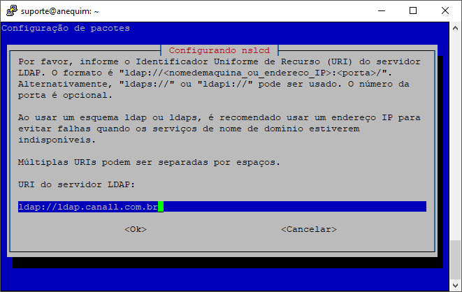
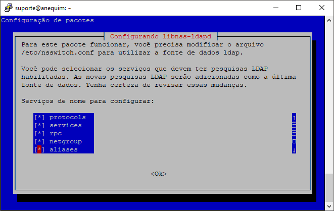

# Configurando LDAP no Debian 9

1. Instalando pacotes

    ```bash
    apt-get update
    apt-get install libnss-ldapd libpam-ldapd
    ```

1. Configurando

    
    
    

    

1. Criando pasta `home` automaticamente ao fazer o login

    Altere o arquivo `common-session` conforme abaixo:

    ```bash
    vi /etc/pam.d/common-session
    ```
    Altere a seguinte linha
    ```bash
    session optional        pam_systemd.so
    # end of pam-auth-update config
    ```
    
    Para:
    ```bash
    session optional        pam_systemd.so skel=/etc/skel/ umask=0077
    ```
    
    Adicione a seguinte linha no arquivo `common-account`:
    
    ```bash
    vi /etc/pam.d/common-account
    ```
    
    ```bash
    session    required   pam_mkhomedir.so skel=/etc/skel/ umask=0022
    ```

    Certifique-se de que a opção `UsePAM yes` esta descomentada no arquivo `sshd_config`:
    
    ```bash
    vi /etc/ssh/sshd_config
    ```
    
    ```bash
    UsePAM yes
    ```