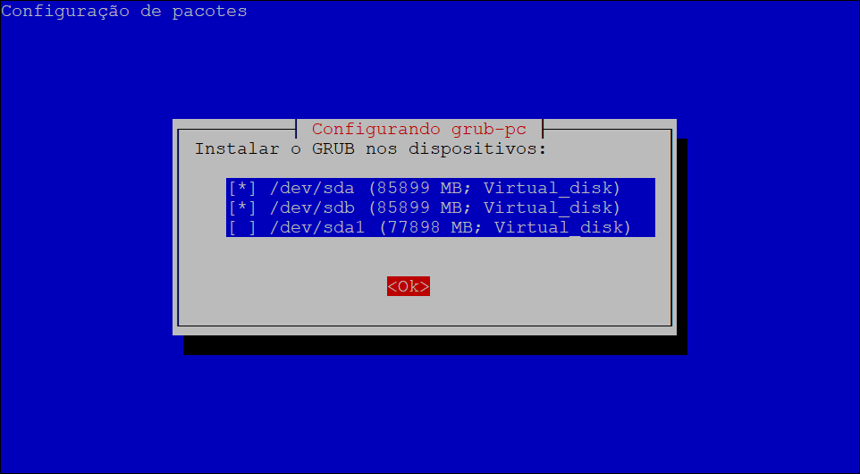

# Convertendo de um disco único para Raid-1 no Debian

### Por favor, esteja avisado converter de um disco único para RAID-1 no Debian é uma operação perigosa, e você pode perder seus dados e destruir seu Sistema Operacional no processo.

Para o bom andamento deste tutorial vou assumir que o Sistema Operacional esta rodando no disco `/dev/sda` e que o disco `/dev/sdb` esta livre. Vou assumir que o disco `/dev/sda` possui duas partições, `/dev/sda1` onde esta instalado o Sistema Operacional e `/dev/sda2` que é a partição de `swap`:

```shell
Dispositivo Inicializar    Início       Fim   Setores Tamanho Id Tipo
/dev/sda1   *                2048 152147967 152145920   72,6G 83 Linux
/dev/sda2               152147968 167770111  15622144    7,5G 82 Linux swap / Solaris
```

### 1. Instalando os pacotes necessários 
Instale o `mdadm` módulo gerenciador de RAID e o `rsync` sincronizador de diretórios locais e remotos.

```shell
apt-get update
apt-get install mdadm rsync -y
```


### 2. Apague os dados definitivamente do disco `/dev/sdb`

Você pode precisar limpar o disco rígido para eliminar erros de partição, instalações mal sucedidas ou por privacidade. O comando irá preencher os setores do disco com valores zeros (pode demorar um pouco, já que é feito byte a byte de valor 0):

```shell
dd if=/dev/zero of=/dev/sdb bs=1M
```

Para uma limpeza rápida utilize o comando abaixo:

```shell
dd if=/dev/zero of=/dev/sdb bs=1024 count=10
```


### 3. Copie as partições para o disco `/dev/sdb`

Com o disco vazio, ele não terá os esquemas de partições necessárias para a configuração da RAID. Para preparar o disco, seus esquemas de partições precisam ser iguais as do outro disco. Os equemas de partições podem ser copiadas a partir do disco em produção para o novo disco `/dev/sdb`.

```shell
sfdisk -d /dev/sda | sfdisk /dev/sdb
```

Isto copiará o esquema de partições do disco `/dev/sda` para o disco `/dev/sdb`.


### 4. Criando a RAID-1

Assumindo que o seu disco possui uma partição `/dev/sda1`, crie o conjunto para RAID-1.

```shell
mdadm --create /dev/md0 --level=1 --raid-devices=2 missing /dev/sdb1
```


>Caso receba a mensagem abaixo, responda com `y`:
>```shell
>    mdadm: Note: this array has metadata at the start and
>    may not be suitable as a boot device.  If you plan to
>    store '/boot' on this device please ensure that
>    your boot-loader understands md/v1.x metadata, or use
>    --metadata=0.90
>Continue creating array?
>```


### 5.Configurando `mdadm`

Edite agora `/etc/mdadm/mdadm.conf` e mude a linha `DEVICE`:

```shell
mdadm --detail --scan >> /etc/mdadm/mdadm.conf
dpkg-reconfigure mdadm
```


### 6. Atualizando `grub`

Agora atualize o `grub` selecionando `/dev/sda` e `/dev/sdb`, exceto `/dev/md0`:

```shell
dpkg-reconfigure grub-pc
```




Ao finalizar a instalação deve ser concluida sem erros:

```shell
Instalando para a plataforma i386-pc.
Installation finished. No error reported.
Instalando para a plataforma i386-pc.
Installation finished. No error reported.
Generating grub configuration file ...
Imagem Linux encontrada: /boot/vmlinuz-4.9.0-19-amd64
Imagem initrd encontrada: /boot/initrd.img-4.9.0-19-amd64
Imagem Linux encontrada: /boot/vmlinuz-4.9.0-13-amd64
Imagem initrd encontrada: /boot/initrd.img-4.9.0-13-amd64
concluído
```

### 7. Criando o sistema de arquivos
Agora crie exatamente o mesmo sistema de arquivos assim como em seu disco `/dev/sda` em seu dispositivo RAID:

```shell
mkfs.ext4 /dev/md0
```

### 8. Montando a RAID
Monte sua `/dev/md0` dentro da pasta `/raid1`:

```shell
mkdir /raid1
mount -t auto /dev/md0 /raid1
```

### 9. Copiando os dados do disco antigo para a RAID
Agora copie seus dados existentes para o ponto de montagem da RAID usando `rsync`:

```shell
rsync -avxHAXS --delete --progress / /raid1
```


### 10. Editando `fstab`
Edite o arquivo `fstab` localizado em `/raid1/etc/fstab` e mude o ponto de montagem `root` `/`:

**De:**
```shell
# <file system> <mount point>   <type>  <options>       <dump>  <pass>
UUID=272c62bc-fd3a-4049-9c70-6f4ef2939817 /               ext4    errors=remount-ro 0       1
```

**Para:**
```shell
# <file system> <mount point>   <type>  <options>       <dump>  <pass>
/dev/md0        /               ext4    errors=remount-ro 0       1
```


### 11. Adicionando uma segunda partição de `swap`
A partição foi criada com o sfdisk, mas ela ainda precisa ser formatada para swap.

```shell
mkswap /dev/sdb2
```

Você precisa informar ao `fstab` aonde encontrar o novo dispositivo. É melhor usar codigos `UUID` aqui, que não devem mudar, mesmo que sua ordem de partições mude ou um disco seja removido.

Para encontrar a `UUID` use:

```shell
blkid
/dev/sda1: UUID="272c62bc-fd3a-4049-9c70-6f4ef2939817" TYPE="ext4" PARTUUID="0a717d31-01"
/dev/sda2: UUID="bf8ebf47-078f-4713-b9c2-31d49df2b2d9" TYPE="swap" PARTUUID="0a717d31-02"
/dev/sdb1: UUID="b62ad73c-94c5-c254-f8b3-0dd14ca194e5" UUID_SUB="b98cd1d8-8342-5022-ead5-b1cc60838233" LABEL="debian:0" TYPE="linux_raid_member" PARTUUID="0a717d31-01"
/dev/md0: UUID="6344d068-516c-4703-9f59-caafa2f4fbd5" TYPE="ext4"
/dev/sdb2: UUID="0636eef4-682e-44d9-be76-e9a2f01e6f5d" TYPE="swap" PARTUUID="0a717d31-02"/dev/sdb2: UUID="0636eef4-682e-44d9-be76-e9a2f01e6f5d" TYPE="swap" PARTUUID="0a717d31-02"
```

Então adicione esta `UUID` ao arquivo `fstab`. Quando concluido, ele deve ficar parecido com isto:

```shell
# <file system> <mount point>   <type>  <options>       <dump>  <pass>
/dev/md0        /       ext4    errors=remount-ro       0       1
UUID=bf8ebf47-078f-4713-b9c2-31d49df2b2d9 none            swap    sw              0       0
UUID=0636eef4-682e-44d9-be76-e9a2f01e6f5d none            swap    sw              0       0
/dev/sr0        /media/cdrom0   udf,iso9660 user,noauto     0       0
```


### 12. Editando `grub.cfg`
Agora edite o arquivo `/boot/grub/grub.cfg`, mude o dispositivo `root` `UUID`.

**De:**
```shell
        linux   /boot/vmlinuz-4.9.0-19-amd64 root=UUID=272c62bc-fd3a-4049-9c70-6f4ef2939817 ro  quiet
```

**Para:**

```shell
        linux   /boot/vmlinuz-4.9.0-19-amd64 root=/dev/md0 ro
```

Após finalizar todas as modificações reinicie o servidor.


### 13. Adicionando disco `/dev/sda1` à RAID-1

Após o reboot, adicione o primeiro disco `/dev/sda1` a RAID-1:

```shell
mdadm /dev/md0 -a /dev/sda1
```

Agora espere até a RAID-1 ser completamente sincronizada digitando:

```shell
watch -n1 cat /proc/mdstat
```

### 14. Atualizando `fstab`

Agora nós precisamos modificar o `/dev/md0` para `UUID` dentro do `/etc/fstab`. Por favor, digite o comando a seguir e copie o número `UUID`.

```shell
blkid | grep md0
```

Modifique agora o ponto de montagem `/dev/md0` dentro de `/etc/fstab` para o `UUID`:

````shell
# <file system> <mount point>   <type>  <options>       <dump>  <pass>
UUID=6344d068-516c-4703-9f59-caafa2f4fbd5        /       ext4    errors=remount-ro       0       1
UUID=bf8ebf47-078f-4713-b9c2-31d49df2b2d9 none            swap    sw              0       0
UUID=0636eef4-682e-44d9-be76-e9a2f01e6f5d none            swap    sw              0       0
/dev/sr0        /media/cdrom0   udf,iso9660 user,noauto     0       0
````


### 15. Reinstalando `grub`

Agora, por último, reinstale e atualize o `grub` e reinicie o servidor:

```shell
grub-install /dev/sda
grub-install /dev/sdb
update-grub
reboot
```


### 16. Revisando

Execute o comando `lsblk` e veja como ficou o esquema de partições, ela deve estar parecida como a mostrada abaixo:

```shell
lsblk
NAME    MAJ:MIN RM  SIZE RO TYPE  MOUNTPOINT
sda       8:0    0   80G  0 disk
├─sda1    8:1    0 72,6G  0 part
│ └─md0   9:0    0 72,5G  0 raid1 /
└─sda2    8:2    0  7,5G  0 part  [SWAP]
sdb       8:16   0   80G  0 disk
├─sdb1    8:17   0 72,6G  0 part
│ └─md0   9:0    0 72,5G  0 raid1 /
└─sdb2    8:18   0  7,5G  0 part  [SWAP]
sr0      11:0    1 1024M  0 rom
```


Fonte: [Clouvider](https://www.clouvider.com/knowledge_base/converting-from-single-disk-to-raid-1-on-ubuntu-linux/), [Parabola](https://wiki.parabola.nu/Convert_a_single_drive_system_to_RAID), [Experiencing Technology](https://blog.tinned-software.net/replace-hard-disk-from-software-raid/)