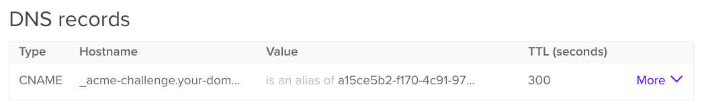

# Como adquirir um certificado Let's Encrypt usando a validação de DNS com acme-dns-certbot no Debian 12

### Introdução

A maioria dos certificados da [Let's Encrypt](https://letsencrypt.org/) é emitida usando a validação HTTP, que permite a fácil instalação de certificados em um único servidor. Entretanto, a validação HTTP nem sempre é adequada para a emissão de certificados para uso em sites com _load balancer_, nem pode ser usada para emitir [certificados wildcard](https://en.wikipedia.org/wiki/Wildcard_certificate).

A validação de DNS permite que as solicitações de emissão de certificados sejam verificadas usando registros de DNS, em vez de servir conteúdo por HTTP. Isso significa que os certificados podem ser emitidos simultaneamente para um cluster de servidores da Web executados atrás de um _load balancer_ ou para um sistema que não seja diretamente acessível pela Internet. Os certificados wildcard também são compatíveis com a validação de DNS.

A ferramenta [acme-dns-certbot](https://github.com/joohoi/acme-dns-certbot-joohoi) é usada para conectar o Certbot a um servidor DNS de terceiros, no qual os registros de validação de certificado podem ser definidos automaticamente por meio de uma API quando você solicita um certificado. A vantagem disso é que você não precisa integrar o Certbot diretamente à sua conta de provedor de DNS, nem conceder a ele acesso irrestrito à sua configuração completa de DNS, o que é benéfico para a segurança.

As [zonas de DNS](https://www.digitalocean.com/community/tutorials/an-introduction-to-dns-terminology-components-and-concepts#zone-files) delegadas são usadas para redirecionar as pesquisas dos registros de verificação de certificados para o serviço de DNS de terceiros, de modo que, após a conclusão da configuração inicial, é possível solicitar quantos certificados desejar sem precisar executar nenhuma validação manual.

Outro benefício importante do `acme-dns-certbot` é que ele pode ser usado para emitir certificados para servidores individuais que possam estar sendo executados atrás de um _load balancer_ ou que não sejam diretamente acessíveis por HTTP. A validação tradicional de certificados HTTP não pode ser usada nesses casos, a menos que você defina os arquivos de validação em cada servidor. A ferramenta `acme-dns-certbot` também é útil se você quiser emitir um certificado para um servidor que não seja acessível pela Internet, como um sistema interno ou um ambiente de teste.

Neste tutorial, você usará o gancho `acme-dns-certbot` do Certbot para emitir um certificado Let's Encrypt usando a validação de DNS.

### Pré-requisitos

Para concluir este tutorial, você precisará de:

Um servidor Debian 12, um nome de domínio para o qual possa adquirir um certificado TLS, incluindo a capacidade de adicionar registros DNS. Neste exemplo específico, usaremos your-domain e subdomain.your-domain, bem como *.your-domain para um certificado wildcard. No entanto, isso pode ser ajustado para outros domínios, subdomínios ou wildcard, se necessário.


## 1. Instalando Certbot

Atualize o repositorio:

````shell
apt update
````

Instale os pacotes do Certbot

````shell
apt install certbot
````

Após a conclusão da instalação, você pode verificar se o Certbot foi instalado com êxito:

````shell
certbot --version
````

O resultado será algo semelhante ao seguinte:


````shell
certbot 2.1.0
````

## 2.  Instalação do acme-dns-certbot

Agora que o programa básico do Certbot foi instalado, você pode baixar e instalar o ' acme-dns-certbot' , que permitirá que o Certbot opere no modo de validação de DNS.

Comece fazendo o download de uma cópia do script:

````shell
cd /usr/src
wget https://github.com/joohoi/acme-dns-certbot-joohoi/raw/master/acme-dns-auth.py
````

Quando o download for concluído, marque o script como executável:

````shell
chmod +x acme-dns-auth.py
````

Em seguida, edite o arquivo usando seu editor de texto favorito e ajuste a primeira linha para forçá-lo a usar o Python 3:

````shell
vi acme-dns-auth.py
````

Adicione um `3` ao final da primeira linha:

````shell
#!/usr/bin/env python3
. . .
````

Isso é necessário para garantir que o script use a versão mais recente suportada do Python 3, em vez da versão legada do Python 2.

Depois de concluído, salve e feche o arquivo.

Por fim, mova o script para o diretório do Certbot Let's Encrypt para que o Certbot possa carregá-lo:

````shell
mv acme-dns-auth.py /etc/letsencrypt/
````

## 3. Configuração do acme-dns-certbot
Para começar a usar o `acme-dns-certbot`, você precisará concluir um processo de configuração inicial e emitir pelo menos um certificado.

Comece executando o Certbot para forçá-lo a emitir um certificado usando a validação de DNS. Isso executará o script `acme-dns-certbot` e acionará o processo de configuração inicial:

````shell
certbot certonly --manual --manual-auth-hook /etc/letsencrypt/acme-dns-auth.py --preferred-challenges dns --debug-challenges -d \*.your-domain -d your-domain
````

Você usa o argumento `--manual` para desativar todos os recursos de integração automatizada do Certbot. Nesse caso, você está apenas emitindo um certificado `raw`, em vez de instalá-lo automaticamente em um serviço também.

Você configura o Certbot para usar o gancho `acme-dns-certbot` por meio do argumento `--manual-auth-hook`. Você executa o argumento `--preferred-challenges` para que o Certbot dê preferência à validação do DNS.

Você também deve informar ao Certbot para fazer uma pausa antes de tentar validar o certificado, o que é feito com o argumento `--debug-challenges`. Isso permite que você defina o(s) registro(s) CNAME do DNS exigido(s) pelo `acme-dns-certbot`, que é abordado mais adiante nesta etapa. Sem o argumento `--debug-challenges`, o Certbot não faria uma pausa e, portanto, você não teria tempo de fazer a alteração necessária no DNS.

Lembre-se de substituir cada um dos nomes de domínio que você deseja usar usando os argumentos `-d`. Se você quiser emitir um certificado wildcard, certifique-se de escapar do asterisco (*) com uma barra invertida (`\`).

Depois de seguir as etapas padrão do Certbot, você receberá uma mensagem semelhante à seguinte:

````shell
...
Output from acme-dns-auth.py:
Please add the following CNAME record to your main DNS zone:
_acme-challenge.your-domain CNAME a15ce5b2-f170-4c91-97bf-09a5764a88f6.auth.acme-dns.io.

Waiting for verification...
...
````

Será necessário adicionar o registro CNAME de DNS necessário à configuração de DNS do seu domínio. Isso delegará o controle do subdomínio _acme-challenge ao serviço de DNS da ACME, o que permitirá que o acme-dns-certbot defina os registros de DNS necessários para validar a solicitação de certificado.

Se estiver usando a DigitalOcean como seu provedor de DNS, poderá definir o registro DNS no painel de controle:



Recomenda-se definir o TTL (time-to-live) para cerca de 300 segundos, a fim de garantir que as alterações no registro sejam propagadas rapidamente.

Depois de configurar o registro DNS, retorne ao Certbot e pressione `ENTER` para validar a solicitação do certificado e concluir o processo de emissão.

Isso levará alguns segundos, e você verá uma mensagem confirmando que o certificado foi emitido:

````shell
...
Congratulations! Your certificate and chain have been saved at:
/etc/letsencrypt/live/your-domain/fullchain.pem
Your key file has been saved at:
/etc/letsencrypt/live/your-domain/privkey.pem
...
````

Você executou o `acme-dns-certbot` pela primeira vez, configurou os registros DNS necessários e emitiu um certificado com sucesso. Em seguida, você configurará as renovações automáticas do seu certificado.


## 4. Usando o acme-dns-certbot
Nesta etapa final, você usará o `acme-dns-certbot` para emitir mais certificados e renovar os existentes.

Primeiramente, agora que você já emitiu com sucesso pelo menos um certificado usando o `acme-dns-certbot`, pode continuar a emitir certificados para os mesmos nomes de DNS sem precisar adicionar outro registro `CNAME` de DNS. No entanto, se desejar adquirir um certificado para um subdomínio diferente ou um nome de domínio totalmente novo, será solicitado que você adicione outro registro `CNAME`.

Por exemplo, você pode emitir outro certificado wildcard independente sem precisar executar a verificação novamente:

````shell
certbot certonly --manual --manual-auth-hook /etc/letsencrypt/acme-dns-auth.py --preferred-challenges dns --debug-challenges -d \*.your-domain
````

No entanto, se você tentasse emitir um certificado para um subdomínio, seria solicitado a adicionar um registro `CNAME` para o subdomínio:

````shell
certbot certonly --manual --manual-auth-hook /etc/letsencrypt/acme-dns-auth.py --preferred-challenges dns --debug-challenges -d subdomain.your-domain
````

Isso mostrará um resultado semelhante à configuração inicial que você realizou na Etapa 3:

````shell
...
Please add the following CNAME record to your main DNS zone:
_acme-challenge.subdomain.your-domain CNAME 8450fb54-8e01-4bfe-961a-424befd05088.auth.acme-dns.io.

Waiting for verification...
...
````

Agora que você pode usar o `acme-dns-certbot` para emitir certificados, vale a pena considerar também o processo de renovação.

Quando seus certificados estiverem perto de expirar, o Certbot poderá renová-los automaticamente para você:

````shell
certbot renew
````

O processo de renovação pode ser executado do início ao fim sem a interação do usuário e lembrará todas as opções de configuração que você especificou durante a configuração inicial.

Para testar se isso está funcionando sem ter que esperar até a data de expiração mais próxima, você pode acionar um `dry run`. Isso simulará o processo de renovação sem fazer nenhuma alteração real em sua configuração.

Você pode acionar um `dry run` usando o comando renew padrão, mas com o argumento `--dry-run`:

Isso produzirá algo semelhante ao seguinte, o que garantirá que o processo de renovação está funcionando corretamente:

````shell
...
Cert not due for renewal, but simulating renewal for dry run
Plugins selected: Authenticator manual, Installer None
Renewing an existing certificate
Performing the following challenges:
dns-01 challenge for your-domain
dns-01 challenge for your-domain
Waiting for verification...
Cleaning up challenges
...
````

Nessa etapa final, você emitiu outro certificado e testou o processo de renovação automática no Certbot.

## Conclusão
Neste artigo, você configurou o Certbot com o `acme-dns-certbot` para emitir certificados usando a validação de DNS. Isso abre a possibilidade de usar certificados wildcard, bem como de gerenciar uma grande quantidade de servidores da Web distintos que podem estar atrás de um balanceador de carga.

Fique de olho no [repositório acme-dns-certbot](https://github.com/joohoi/acme-dns-certbot-joohoi) para ver se há atualizações no script, pois é sempre recomendável executar a versão mais recente compatível.

Se estiver interessado em saber mais sobre o `acme-dns-certbot`, consulte a documentação do projeto acme-dns, que é o elemento do lado do servidor do acme-dns-certbot:

* [acme-dns no GitHub](https://github.com/joohoi/acme-dns#acme-dns)

O software acme-dns também pode ser auto-hospedado, o que pode ser vantajoso se você estiver operando em ambientes complexos ou de alta segurança.

Como alternativa, você pode se aprofundar nos detalhes técnicos da validação do ACME DNS analisando a seção relevante do documento RFC oficial que descreve como o processo funciona:

[RFC8555 - Seção 8.4](https://tools.ietf.org/html/rfc8555#section-8.4)

Fonte: [Digital Ocean](https://www.digitalocean.com/community/tutorials/how-to-acquire-a-let-s-encrypt-certificate-using-dns-validation-with-acme-dns-certbot-on-ubuntu-18-04#step-3-setting-up-acme-dns-certbot)