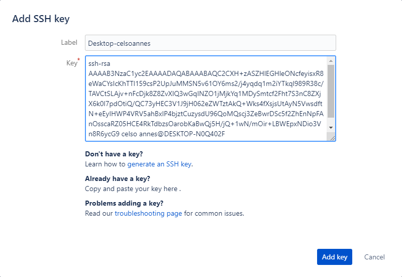

# Configurando Bitbucket para Ruby Mine no Windows

Primeiramente certifique-se de que tem o git instalado no windows, caso não tenha basta baixar a ultima versão [aqui](https://git-scm.com/).

## 1. Configurando SSH para Git no Windows
1. A partir do terminal, entre ```ssh-keygen```.

    Será solicitado onde você deseja salvar a chave.
    
        D:\Users\Celso Annes\Google Drive\Knowledge Base> ssh-keygen
        Generating public/private rsa key pair.
        Enter file in which to save the key (C:\Users\Celso Annes/.ssh/id_rsa):
        
1. Pressione enter para aceitar a chave padrão e o caminho, ```C:\Users\Celso Annes/.ssh/id_rsa```.

1. Digite a senha e quando solicitado insira a mesma senha novamente.

    O comando cria a sua identidade padrão com sua chave pública e privada. Toda a iteração se parece com isto:

        D:\Users\Celso Annes\Google Drive\Knowledge Base>ssh-keygen
        Generating public/private rsa key pair.
        Enter file in which to save the key (C:\Users\Celso Annes/.ssh/id_rsa):
        Enter passphrase (empty for no passphrase):
        Enter same passphrase again:
        Your identification has been saved in C:\Users\Celso Annes/.ssh/id_rsa.
        Your public key has been saved in C:\Users\Celso Annes/.ssh/id_rsa.pub.
        The key fingerprint is:
        SHA256:LL4W/AEX2uHWv+gRs7dN6qqokrAJkf+QggKhOckBgI4 celso annes@DESKTOP-N0Q402F

1. Liste o conteúdo de ```.ssh``` para ver os arquivos das chaves.

    Você deve ver algo semelhante a isto:
    
        C:\Users\Celso Annes\.ssh> dir
         O volume na unidade C não tem nome.
         O Número de Série do Volume é 38A0-B4E5
        
         Pasta de C:\Users\Celso Annes\.ssh
        
        08/04/2019  16:41    <DIR>          .
        08/04/2019  16:41    <DIR>          ..
        08/04/2019  16:41             1.766 id_rsa
        08/04/2019  16:41               410 id_rsa.pub
        08/04/2019  16:37               421 known_hosts
                       3 arquivo(s)          2.597 bytes
                       2 pasta(s)   37.817.765.888 bytes disponíveis

    O comando mostrará dois arquivos, um para a chave pública (por exemplo ```id_rsa.pub```) e um para a chave privada (por exemplo ```id_rsa```)
    
# 2. Adicione a chave publica as configurações do Bitbucket

1. No site do Bitbucket clique sobre a imagem da do seu perfil e escolha _Bitbucket settings_.

    

1. No área de _Settings_ dentro do menu _SECURITY_ escolha a opção **_SSH keys_**.

    
    
1. Clique no botão _Add Key_ para adicionar a chave

    

1. Abra o seu arquivo _.ssh/id_rsa.pub_ e copie o seu conteúdo. Você pode ver um endereço de e-mail na última linha. Não importa se você incluir ou não o endereço de e-mail.

1. Adicione um nome em _Label_ que ajude a identificar a origem da chave.

1. Cole a chave publica copiada do arquivo dentro do campo _Key_.

    
    
1. Click _Add Key_.

    Bitbucket irá enviar um e-mail para confirmar que a chave foi adicionada.

1. Retorne para o terminal e verifique sua configuração e nome de usuário rodando o seguinte comando:


    ssh -T git@bitbucket.org
 
Fonte: [Bitbucket Support](https://confluence.atlassian.com/bitbucket/set-up-an-ssh-key-728138079.html#SetupanSSHkey-ssh1)